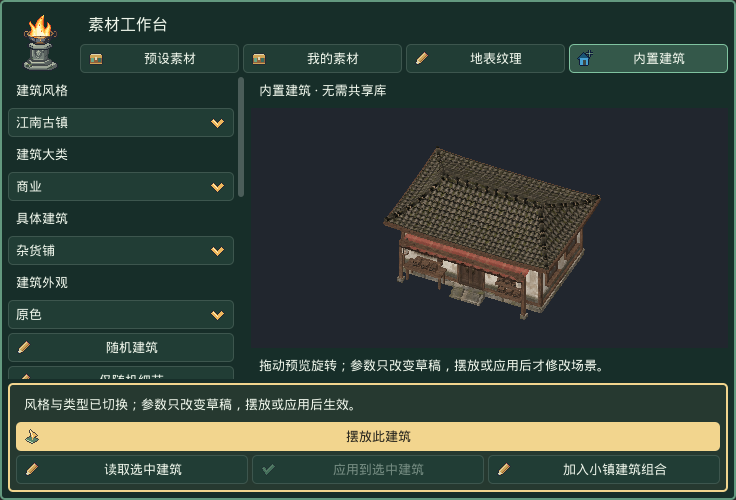

# Jeff Studio Godot场景插件

**在 Godot 中，通过可视化工具制作 HD-2D 地形、建筑与小镇。**

Jeff Studio Godot场景插件（Jeff Studio Scene）是一款 Godot 场景制作插件，提供中英文界面，将地形编辑、建筑生成、素材摆放、角色、镜头、环境和音乐工具集中在编辑器中。

[下载 0.4.6](https://github.com/Smidle/jeff-studio-scene/releases/tag/v0.4.6) · [独立说明书](manual/README.md) · [反馈问题](https://github.com/Smidle/jeff-studio-scene/issues)

## 主要功能

- **地形编辑**：升高、降低、平滑、平整、斜坡及地表绘制；提供 35 张内置原创地表纹理和 14 套地表方案。
- **内置建筑工作台**：江南古镇、欧式风格、沙漠聚落三种风格，覆盖 10 大类、46 种建筑类型；可调整外形、门窗、屋顶、外观和随机种子。
- **小镇生成**：单排、双排和中心环绕布局，支持道路、广场、围墙、局部整地与蓝图摆放；参数及种子随场景保存，便于重复生成。
- **素材与实例编辑**：导入和摆放自有素材，编辑已放置实例，通过笔刷铺设物件与道路；支持按需连接工程外的共享素材库。
- **角色与镜头**：导入自己的角色序列帧，设置动画、脚底锚点和移动参数，配置自由地图、循环场景及镜头。
- **环境、音乐与预览**：调整场景环境，管理音乐，并使用独立场景预览检查行走效果。
- **中英文界面**：主要操作通过侧栏、工作台和原生 Inspector 完成。

## 安装概要

1. 打开或新建一个 **Godot 工程**。
2. 从 [Releases](https://github.com/Smidle/jeff-studio-scene/releases/tag/v0.4.6) 下载 `01_HD2D_0.4.6_Plugin_Manual.zip` 并解压。
3. 将 `addons/hd2d_scene_tools/` 复制到已有 Godot 工程的 `addons/` 目录。
4. 等待资源导入完成，在 **项目 → 项目设置 → 插件** 中启用 **Jeff Studio Scene**。

此仓库是插件与文档包。使用前需要已有 Godot 工程；更新插件前请备份旧版本。

## 文档与资源

完整的安装步骤、功能参数、操作顺序和参考资料放在独立的 **[说明书目录](manual/README.md)**，可在 GitHub 阅读 Markdown 版，或下载后在浏览器中打开 `START_HERE.html` 阅读中英文 HTML 版。

内置建筑与地表可直接使用。共享素材库和历史案例是可选的独立资源包，本仓库及本次 Release 仅包含第一包「插件与说明书」。

公开版本不附带原学习包中的三位游戏提取角色预设；角色导入功能保留，可使用自己的角色素材。公开版与学习版的资源差异见 [分发说明](manual/DISTRIBUTION.md)。

## 版本与反馈

当前插件版本为 **0.4.6**，发布标签为 **`v0.4.6`**。下载包、更新说明和后续版本统一在 [Releases](https://github.com/Smidle/jeff-studio-scene/releases) 中发布。

通过 [Issues](https://github.com/Smidle/jeff-studio-scene/issues) 报告问题时，请附上 Godot 版本、操作系统、复现步骤和报错信息；功能建议也欢迎提交。

## 许可

插件代码沿用原包中的 [MIT License](LICENSE)，原始许可证同时保留在 `addons/hd2d_scene_tools/LICENSE`。资源的来源与分发标识见 [分发说明](manual/DISTRIBUTION.md)。
