# Assets and Scene Instance Editing

> **GitHub public edition:** The original 0.4.6 learning manual is retained below. The three extracted character presets, optional shared library and historical case packages are not bundled in this public release. Built-in buildings and terrain are included; use your own character assets. [Public distribution details](../../DISTRIBUTION.md)

## Built-in Buildings: choose a function, then its shape

Open **Asset Workbench → Built-in Buildings** and choose **Building Style → Building Category → Building Type → Appearance**. Jiangnan, European and Desert Settlement each support the 46 functional entries below without a shared library. Changing style or type loads a complete default design and live preview immediately.

Jiangnan uses curved tiled roofs, timber frames and stone bases; European uses pitched roofs, timber/stone construction and suitable towers; Desert uses thick walls, arched openings, terraces and shade canopies. Shared structural skeletons carry distinct functional components: a forge has a furnace and chimney, an apothecary has medicine drawers, a mill has a wheel, and a dock has decking and supports.

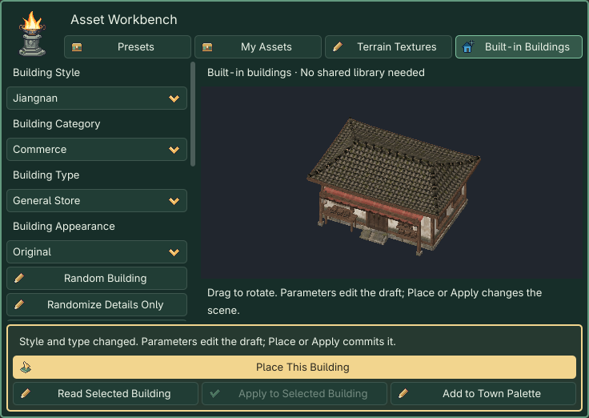

### Building catalog

Cultural names vary while functional IDs remain stable. Differing names below are listed in Jiangnan / European / Desert order.

| Category | Building types |
| --- | --- |
| Residential | Home; Farmhouse; Merchant Residence; Manor |
| Commerce | General Store; Weapon Shop; Armor Shop; Apothecary; Market Stall |
| Hospitality | Inn; Tavern; Tea House / Tea Room / Desert Tea House; Posthouse / Coaching Inn / Caravanserai |
| Crafts | Smithy; Carpentry Workshop; Tailor Workshop; Elixir Workshop / Alchemy Workshop / Potion Workshop |
| Agriculture & Storage | Granary; Mill; Stable; Animal Shed; Greenhouse |
| Administration | Magistrate Office / Administrative Residence / Governor Palace; Council Hall / Town Hall / Council House; Guild Hall; Escort Guild / Mercenary Lodge / Caravan Guardhouse; Sect Great Hall / Knight Order Hall / Tribal Great Hall |
| Religion & Culture | Temple / Monastery / Prayer Courtyard; Ancestral Hall / Memorial Hall / Ancestral Sanctuary; Sacred Great Hall / Cathedral / Domed Sanctuary; Scholars Academy / Academy / School; Book Pavilion / Library / House of Books |
| Defense | City Gate; City Wall; Watchtower; Barracks; Fortress |
| Transport | Dock; Boathouse; Carriage Station / Coach Station / Caravan Station; Mountain Pass |
| Exploration | Abandoned House; Ruins; Tomb Entrance; Mine Entrance; Mystic Tower / Mage Tower / Astronomer Tower |

### Two random levels and independent appearance

| Action | Changes | Preserves |
| --- | --- | --- |
| Random Building | New shape/detail seeds; constrained dimensions, floors, roof and porch | Style, type and mandatory functional components |
| Randomize Details Only | Window decoration, signs and local detail combinations | Body dimensions, entrance, window columns and collisions |
| Reproduce from Seeds | Refills structural parameters from the shape seed, using the current detail/appearance seeds | Identical version, style, type and seeds reproduce the same combination |
| Original / Elegant / Warm / Weathered | Semantic material slots for roof, wall, timber and stone | Geometry, layout and collision |

Save the complete scene and generated resources after manual edits: seeds alone do not preserve those changes. **Shape Seed, Detail Seed and Appearance Seed** are independent. Reproduce from Seeds refills structural parameters, so it replaces manual shape edits in the draft.

Houses expose dimensions, 1–3 floors, roofs, pitch, eaves and window columns. Stalls expose canopy height and shelf bays; walls expose length, thickness, height and segmentation; docks expose platform width, pier length, deck height and supports. Inapplicable controls are hidden. Window columns count actual windows on each main wall and floor, excluding doors and dormers; odd front counts put one extra on the left. Narrow walls compress complete frames.

Three original style atlases organize roofing, timber, walls, stone bases, doors, windows and decoration. Fine tile joints, grain, lower-wall bands and wear are textures; eaves, beams and frames retain geometry. Repeating materials target about 40 pixels per metre; component panels fit their door/window dimensions. Godot cuts separate role tiles and builds independent mip chains to prevent adjacent atlas cells bleeding. Nearest sampling is used nearby and mipmaps at distance. Appearance Seed adjusts material tones without changing structure. These remain lit 3D models; screen-space silhouette edges are not automatically pixelated.

### Place, apply and save

1. Drag the preview to inspect it. Dimensions describe the main body; eaves, steps and wings extend the actual footprint. Public buildings retain preset body scaling.
2. The gold **Place This Building** opens a blueprint. Point to terrain, Q / E rotate 15°, left-click confirms, Esc cancels. Static collision is enabled; individual placement does not grade slopes, so prepare a foundation first.
3. Select a placed building or its internal mesh, **Read Selected Building**, edit, then **Apply to Selected Building**. Transform and instance settings remain intact. Undo / Redo is a single action.
4. **Add to Town Palette** creates a custom palette entry. Automatic functional quotas are described under [One-click](generation.md).
5. Save with Ctrl+S / Cmd+S. Back up `hd2d_generated/buildings` with your scene: it holds meshes, materials and complete recipes. Runtime needs neither external libraries nor regeneration.

New recipes use generator **v5**, while the plugin stays 0.4.6. Reading v1–v4 preserves their geometry and IDs; selecting a category/style creates a v5 draft, and only Apply changes the instance. The legacy v2 window correction path remains compatible. The internal `forest` identifier is retained; its display name is now **European**.

These are exterior models with basic collision, without interiors, commerce, production, underground caves or transport systems. Gates and open shelters retain entrances; docks have solid decks. Tomb and mine entrances have closed rear walls and do not lead underground.

### Nine revised HD2D designs

This revision individually refines the House, General Store and Inn in all three styles. Other functional types retain their defining components and reuse applicable new materials; they were not individually polished in this pass. Shared-library models informed proportions and material layering only. These generated models and original atlases work independently inside the plugin.

| Style | House | General Store | Inn |
| --- | --- | --- | --- |
| Jiangnan | 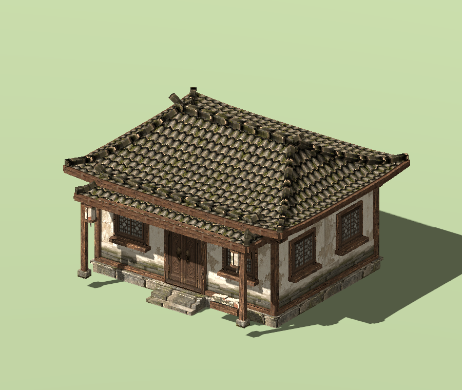 | 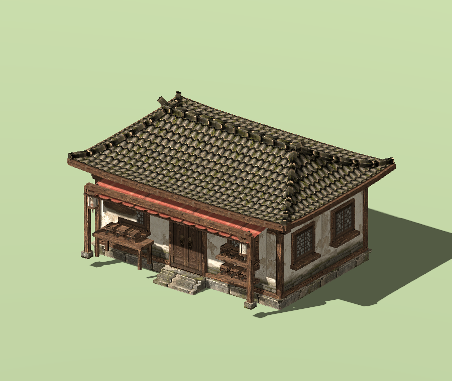 | 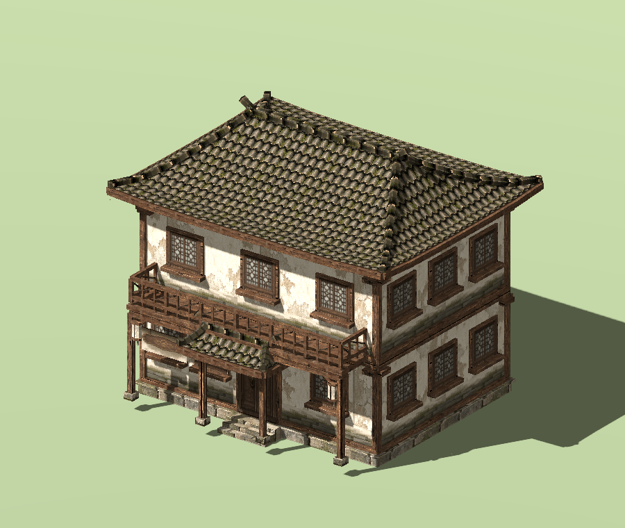 |
| European | 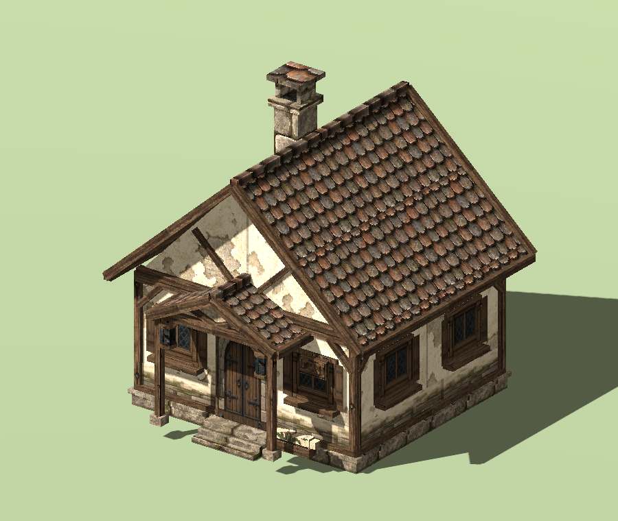 | 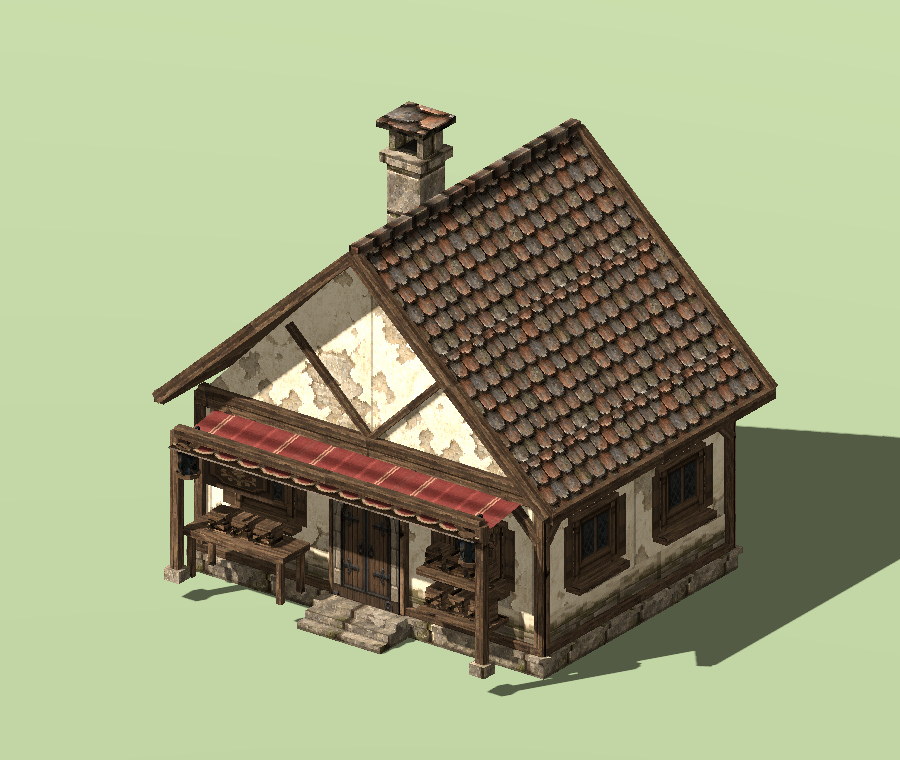 | 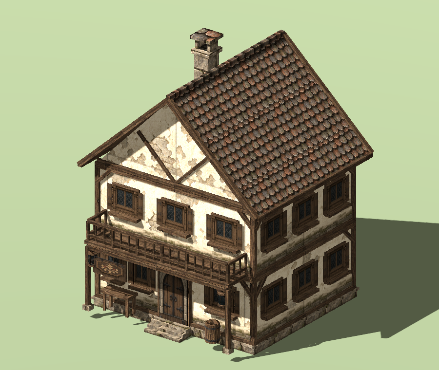 |
| Desert | 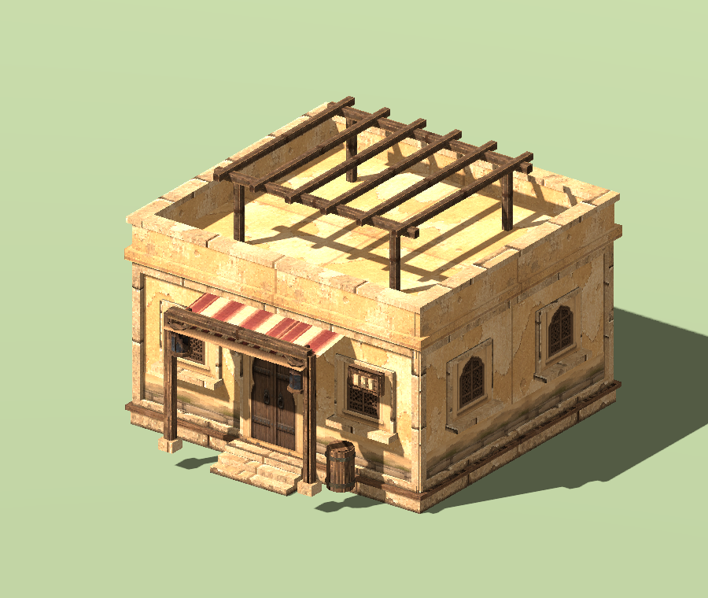 | 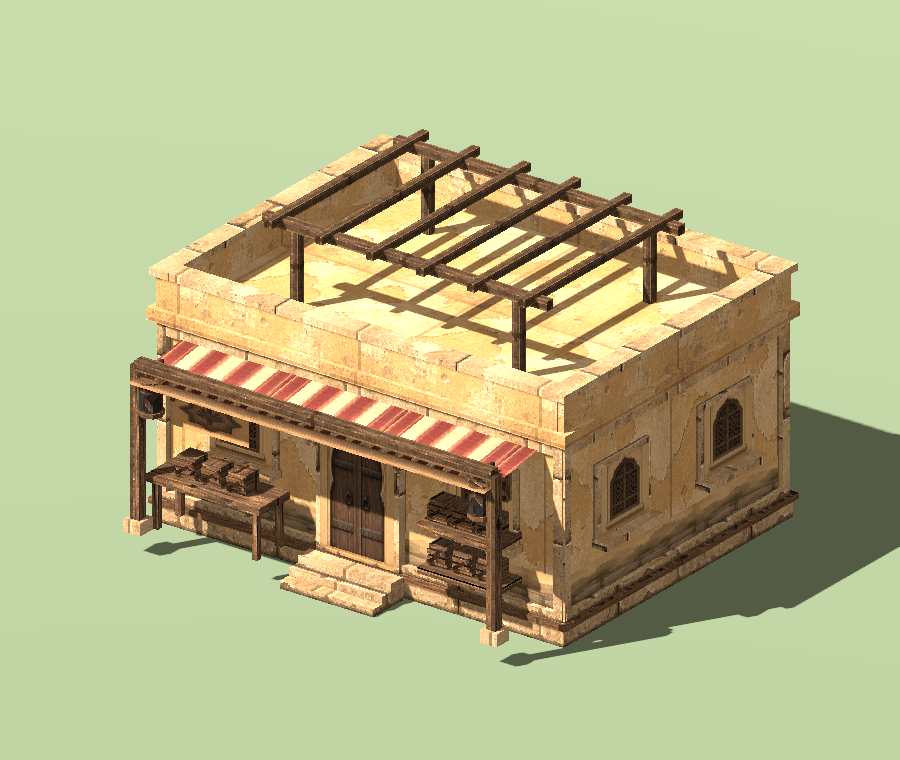 | 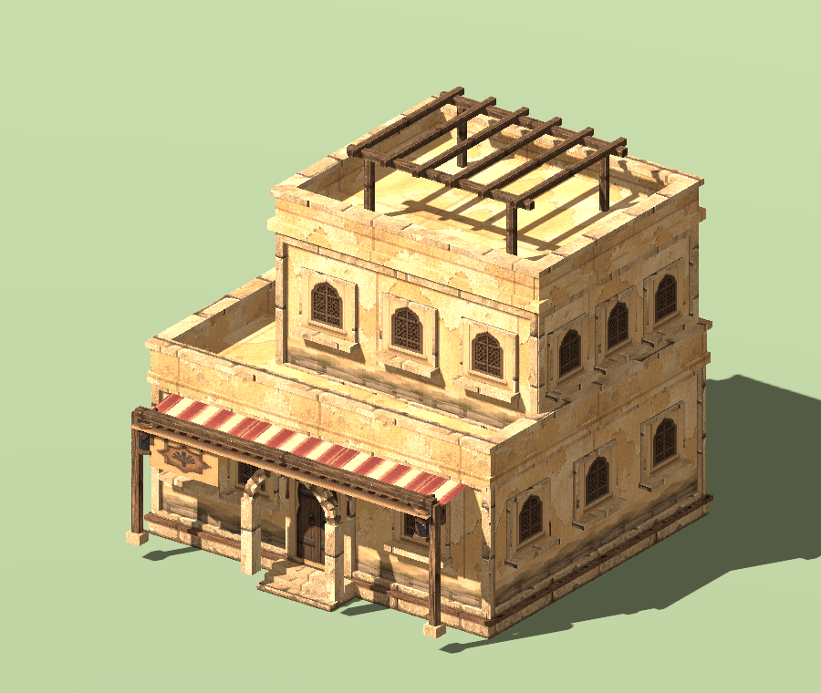 |

Actual Godot 4.7.2 / Compatibility captures with the same lighting, orthographic angle and display dimensions, framed to each model’s bounds. Jiangnan features curved eaves, stone bases and galleries; European adds timber/stone construction, shop canopies and guest floors; Desert uses thick walls, terraces, niches and recessed upper floors.

## External assets and scene instances

The workbench selects assets for repeated placement. The right Assets module edits an explicitly selected scene instance.

1. Choose an asset, click the gold Place Selected Asset button and click the terrain.
2. Use Edit Last Placed Object, or press Esc and select the object in the scene tree or viewport.
3. Adjust applicable settings and Apply Asset Settings to change only this instance.
4. To synchronize the same asset throughout the scene, use Apply to All Matching Scene Assets and review the scope. Only changed fields are copied.

Selecting an asset thumbnail alone does not identify an instance. Use Choose Scene Instance… to choose one. Clicking the current instance's asset preserves its target and draft. Model instances hide image-only atlas, crop and card controls.

Library thumbnails are reused in the right panel and cached locally. If the cache is removed, previews are regenerated from prepared project resources. Replacing the placed object is unnecessary.

Use the bottom Asset Workbench to select shared assets, and the right-hand Assets module to edit scene objects.

**Surface textures are selected in Terrain:** the shared package also contains 35 original textures and 14 schemes. Open the bottom terrain workspace from [Terrain → Surface layers & painting](terrain.md). It shares the object-library path without registering terrain as placeable entries. Keep terrain-index.json beside terrain when upgrading.

The library provides original appearances for models and image cards, marked for local study. Available skins are listed on each entry.

**Place first, then select a scene object to edit its parameters.** The prominent **Preset Asset Library** opens the bottom Asset Workbench for image cards and solid models. PNG files remain image cards.

## Preset Asset Library and shared location

Use **choose asset → choose skin → preview → place**. The **Presets / My Assets** source filter shares series, category, search and preview controls. Each page loads at most48 thumbnails. Presets are read-only; your imports enter My Assets. Hold the left mouse button over the model preview to rotate it.

Choose the library folder on your computer. **Location…** at the top of the plugin selects a folder outside the project. Godot editor settings store the location for other projects. The separate third ZIP, `03_HD2D_0.4.5_Shared_Asset_Library.zip`, supplies the `HD2D_Shared_Asset_Library` folder for this external location. **Keep it outside your project.** Case Assets does not bundle the shared library; the five cases work without downloading it. Keep `preset-index.json` beside `presets`; preserve your existing `index.json` and `objects`. For historical cases, follow their original packaged instructions under [Historical Cases and Resources](../history.md).

Browsing reads the index and current-page thumbnails. Selecting an asset prepares only that entry and its dependencies inside the project, with progress. An outdated preparation cannot replace a newer selection’s preview. Prepared and saved scenes use project-local resources and continue running with the shared drive disconnected. First placement registers the entry in the scene list; repeated placement does not duplicate it. Registration and placement undo together. Associated but unregistered objects also appear in the scene list; browsing does not save the scene.

Skins are preconfigured complete appearances. Available choices depend on the installed entry. **Selecting a skin affects preview and future placement**. To change existing objects, click **Apply Skin** for Selected Objects or All Compatible Objects in Current Scene. The panel reports impact and incompatibilities; a batch is one undo step. **Restore Original Appearance** stages the original; Apply Skin commits it. Shape, transform and collision remain unchanged. The study package mainly provides original appearances. Entries without alternatives need no extra skin selection.

## Shared import settings on another computer

An error naming `.png.import` occurs while preparing a selected entry; it does not mean the model catalog is absent. Keep the extracted library outside the project. If that sidecar was deleted or rewritten, extract a fresh copy or update both the numbered plugin package and shared-library package. The catalog retains verified original import settings independently, and `.gdignore` prevents accidental bulk scans. Raw images and models still require matching hashes. Preserve your personal index.json and objects when upgrading.

For a new scene, install **01 Plugin** and connect **03 Shared Library** outside the project; **02 Cases is not required**. You can browse and preview before creating a map. An active stage is needed for placement. To test, search for `SM_NJ_JiuGuan001`, select its thumbnail, and check that the rotatable tavern appears on the right.

The preparation status shows the selected asset, the file being copied or the elapsed Godot import wait. Use **Cancel Preparation**, or select another asset. An import wait exceeding 90 seconds names the pending files and offers **Retry Preparation**. Check Godot’s Output and Import panels before retrying. Keep an already connected library path; copying the entire library into the project is unnecessary. Failed or changed selections clear the previous preview image.

## Import destination

Expand **Import & checks**, which starts collapsed, then choose the destination before using the file picker, OS drop window or project-file drop area.

| Destination | Result |
| --- | --- |
| Local Shared Asset Library | No active stage required. Saves complete dependencies and a real thumbnail to My Assets; does not register or place anything in the current scene. |
| Current Scene → Library & Placement | Adds entries to the current stage only. This is the first-use default; the project remembers the next choice. |

Import Results reports destination, successes, duplicates and failure reasons. Shared imports reuse identical content and keep different content with the same filename separate. Missing dependencies, unresolved UIDs, remote glTF references and custom scripts with unverifiable runtime dependencies are rejected with a reason; the original project importer remains available. A write lock and atomic index update protect simultaneous writers. After an abnormal exit, confirm that the owning process has exited before backing up and moving `.write-lock` aside to retry.

Import settings such as model scale travel with the resource and participate in duplicate detection. For custom import settings that reference external resources or scripts, first export a self-contained GLB from the source project; the library does not silently discard those settings.

## Single-object and batch parameters

**Current scene asset editing** contains Library & placement through Color key & native material sections. The parent, Library & placement, and Import & checks start collapsed, then remember your choices. Current object, source, changed fields and tool status remain visible. Thumbnail selection alone disables parameter Apply.

| Button | Scope |
| --- | --- |
| Apply Asset Settings | The single selected linked object. |
| Apply to All Matching Assets in Current Scene | Matching objects and linked foliage records throughout the edited scene. Review count, fields and skipped reasons before committing one undoable transaction. |

Only fields edited in this draft are synchronized. A collision-only change preserves other objects’ animation, wind, skin and Transform. Single Apply retains the changed-field set for a subsequent batch; selecting another object clears it. Stable entry IDs keep separate crops of one atlas distinct. Legacy resources match only when they share the actual Resource reference.

Name, category, duplication, relinking and removal remain separate entry-management operations. Use **Save Entry Name & Category** for metadata. Duplicate a read-only preset before editing its entry. A duplicate has a new ID and shares its source image or model. Instance settings do not rewrite source meshes, images or preset materials. Save with Cmd+S / Ctrl+S.

## Default collision and gold placement action

New imports, placements and foliage scatter enable static collision for both image cards and 3D models. Newly placing an older library entry follows the same rule; reinstalling the shared package is unnecessary.

Enable static collision starts checked. Selecting a library entry shows the collision settings for a new placement; selecting a scene object shows that object's saved effective settings. Built-in buildings and generated towns also enable building collision by default.

- **2D images:** an anchor-aligned box matches the card width and height, with 0.5 m depth. Transparent pixels do not cut holes.
- **3D models:** reuse authored static collision when available; otherwise generate collision from the original meshes. Choose Box or Capsule to simplify it.
- **Adjust or disable:** select the placed object, edit Enable static collision and its shape, then Apply Asset Settings. Use the separate matching-assets action for a batch.

Previously placed objects and foliage records keep their saved settings. To update them, explicitly apply collision settings.

After preparation completes, click the gold **Place Selected Asset** button at the bottom of the workbench, then click a ground position in the scene.

Godot 4.7.2 / Compatibility, using simple image and box fixtures. The enabled gold action starts placement.

## Collision reference lines and testing

Use **place → select object → confirm static collision is enabled → Show Collision Reference Lines → edit shape, size and offset → single or batch Apply → isolated walking test**.

**Show Collision Reference Lines** starts off and remembers the project’s editor preference. Only the selected object is outlined. Drafts immediately update the outline and show Unapplied; physical collision changes only on Apply. The editor Gizmo follows move, rotation and scale. It is not serialized and does not enter the game or isolated preview. Deselecting, disabling the checkbox or disabling collision clears it. The existing placement-wireframe checkbox independently controls the placement ghost.

Use boxes for crates and simple walls, capsules for trunks, and original mesh shapes when geometric detail matters. Transparency does not generate holes. Test three placements: single Apply should change one; batch Apply should copy only the collision fields to the others. One Undo reverses the batch. Save/reopen, then verify walking collision in isolated preview; editor outlines are absent there.

## Categories, brazier sheets and wind

**Assign an imported entry:** select the stage root → Assets → click its thumbnail → expand **Entry management** and edit **Asset category** → **Save Entry Name & Category** → save. Use a name such as Props / Braziers. If filtering hides the entry, switch Category to All. The text above Import assigns the next batch; the dropdown by Search only filters. Categories do not move files, create collision or control wind/animation, and user-authored category names are not translated.

**Use wind sway 0 for rigid objects.** New imports default to 0; existing plants can keep their own wind values. A category name does not enable or disable motion.

| Setting | New import default | Range / step | Effect |
| --- | --- | --- | --- |
| Asset wind sway | 0 | 0…1 / 0.01 | 0 keeps a card rigid; try 0.08 for plants. Applies to plugin picture-card materials, not arbitrary imported 3D shaders. Legacy resources may still show 0.08. |

Select the brazier → expand **Card appearance & wind** → set **Asset wind sway=0**, Apply Asset Settings and save. Environment → Plant wind strength is the whole-stage multiplier: zero stops the flowers too. Wind bends geometry; sprite-sheet playback changes frames independently. Procedural cloud shadows can still vary brightness without bending an object.

**Configure the actual fire sheet:** brazier_lit_sheet.png is 256×256, four columns/four rows, 16 frames of 64×64. Place it and select the scene object, Reset to Full Image (region width/height both zero), then apply:

| Setting | Suggested value |
| --- | --- |
| Loop Regular Sprite Sheet | On |
| Sprite sheet columns / rows | 4 / 4 |
| Start frame (zero-based) | 0 |
| Frame count | 16 |
| Sheet FPS | 8, a suggestion rather than verified original timing |
| Asset wind sway | 0 |
| Horizontal / foot anchor | 0.5 / 1; refine against the visible base |
| Card width / height | Start at 2 / 2 m, then scale for the scene |
| Nearest sampling / Color-key transparency | On / Off; this image has alpha |

Frames run left-to-right, then top-to-bottom; 16 frames at 8 FPS take about two seconds. Check Play Applied Asset Preview, place a linked prop, then open scene Preview. brazier_unlit.png is static: leave sheet animation off and wind zero. Images do not generate light; add a native OmniLight3D if the flame should illuminate its surroundings.

**An old placed brazier does not update?** Earlier placements are independent MeshInstance3D nodes, not linked HD2DProp nodes. Back up the project and record the old Transform, place a new instance using the updated entry, match its transform and verify it before removing the old node. Do not delete all of Scenery. To stop wind on an old card only, use native Material Override → Shader Parameters → wind_amount=0; Make Unique first if the material is shared. This does not connect its old material to the new sheet settings.

Single Apply changes the selected linked prop. The separate batch button also updates matching Foliage records. Save and back up your project before replacing the addon; keep your scenes and original images.

## Collapsible visual groups

Click a bordered heading to expand or collapse it. Common groups start open (★); your choice is remembered per project. **Expand All / Collapse All** only affects this page. Tab to a heading and use Enter/Space, or Left/Right. Hiding controls keeps drafts and active tools/audition; it neither applies settings nor saves the scene. Asset Apply buttons are inside Current scene asset editing, outside its parameter subgroups.

| Group | Contains |
| --- | --- |
| [Import & checks](#group-assets-import) | OS drop window, project drop zone, import category, pixel import, results and missing-resource check. |
| [Current scene asset editing](#group-assets-scene) | Scene asset subgroups and single/batch Apply; initially collapsed. |
| [Library & placement](#group-assets-library) | Search, category filter, multi-select thumbnails and placement; collapsing does not stop the tool. |
| [Entry management](#group-assets-entry) | Entry name/category, duplicate and relink; disk filenames are unchanged. |
| [Card appearance & wind](#group-assets-card) | Size, anchors, facing, alpha cutoff, filtering and per-asset wind. |
| [Atlas crop](#group-assets-crop) | Crop preview, X/Y/width/height and reset; values remain drafts until Apply. |
| [Sprite-sheet animation](#group-assets-sheet) | Sheet toggle, grid, frame interval, FPS, aspect fitting and applied-asset preview. |
| [Static collision](#group-assets-collision) | Collision toggle, mesh/box/capsule, dimensions/offset, box fitting and placement wireframe. |
| [Color key & native material](#group-assets-material) | Color key, tolerance and native material editor; keep keying off for real alpha. |

**Import & checks**

**Current scene asset editing**

**Library & placement**

**Entry management**

**Card appearance & wind**

**Atlas crop**

**Sprite-sheet animation**

**Sprite-sheet animation · lower controls**

**Static collision**

**Color key & native material**

## Buttons and operations

| Visible button | What it does / when it applies |
| --- | --- |
| + Import Assets (multiple) | Imports images, GLB/glTF, scenes or mesh resources into the library. External files are copied into the project; preserve scene dependencies rather than copying only a tscn. |
| Place Asset | Shows a placement preview; click the ground to place the selected asset and press Esc to finish. Thumbnail dragging is an alternative. |
| Reset to Full Image | Resets the four crop values to zero; Apply Asset Settings is still required to commit them. |
| Edit Current Object in Inspector | Opens the selected linked object for its own Material Override, Cast Shadow and Transform settings. |
| Apply Asset Settings | Commits overrides to one selected linked object. Use the separate batch button to synchronize changed fields to matching objects and foliage records. |
| Remove Entry (keep file) | Removes the selected library entry without deleting its disk file; separately check existing scenery references. |

## Every parameter

Most numeric fields are drafts until the relevant Apply button is clicked. Tool settings are read when you paint/place; imports and file-selection actions run immediately. Apply is not a disk save: use Ctrl+S / Cmd+S afterward. Check the action descriptions for exceptions.

Ranges show minimum … maximum; step. Options show the available choices. Units and conditions are explained in the final column. Sliders and their numeric boxes edit the same value, not two separate parameters.

| Parameter | Initial default | Range / step / options | Meaning and limits |
| --- | --- | --- | --- |
| Lossless pixel art / disable auto 3D compression [Import & checks](#group-assets-import) | On / 开 | — | Preserves pixel textures during import by disabling automatic 3D compression; does not upscale or improve the original artwork. |
| Category [Library & placement](#group-assets-library) | All | All | Filters the visible library entries only; does not recategorize or delete assets. |
| Card width (m) [Card appearance & wind](#group-assets-card) | 2 | 0.05 … 100; 0.05 | Card width in world meters; import may initialize it from the image aspect ratio. |
| Card height (m) [Card appearance & wind](#group-assets-card) | 2 | 0.05 … 100; 0.05 | Card height in world meters; together with width, determines the displayed aspect ratio. |
| Horizontal anchor [Card appearance & wind](#group-assets-card) | 0.5 | -0.5 … 1.5; 0.01 | Horizontal placement pivot: 0 left, 0.5 center, 1 right; values can extend outside the image. |
| Foot anchor [Card appearance & wind](#group-assets-card) | 1 | -0.5 … 1.5; 0.01 | Vertical pivot: 0 top, 1 bottom. With transparent margins, align it to the visible plant base. |
| Card facing [Card appearance & wind](#group-assets-card) | Fixed plane | Fixed plane, Face camera around Y | Fixed plane preserves the authored orientation; Y-axis billboarding turns toward the viewer without tilting up or down. |
| Alpha cutoff [Card appearance & wind](#group-assets-card) | 0.5 | 0 … 1; 0.01 | Pixels below the alpha threshold are discarded. Increasing it tightens edges but can remove thin leaves or hair. |
| Nearest-neighbor sampling [Card appearance & wind](#group-assets-card) | On / 开 | — | Nearest filtering retains hard pixel edges; disable it for smoothly filtered high-resolution textures. |
| Enable static collision [Static collision](#group-assets-collision) | On for new imports / placements | — | Adds the configured collision shape; see the collision parameters below. Alpha does not cut holes. |
| Color key (solid-background RGB images only) [Color key & native material](#group-assets-material) | Off / 关 | — | Display-time color removal for RGB images with a solid background; leave disabled for images with real alpha. |
| Key color [Color key & native material](#group-assets-material) | 212121 | Color | Selects the background color to hide; matching colors inside the artwork are affected too. |
| Key tolerance (linear color) [Color key & native material](#group-assets-material) | 0.005 | 0 … 0.25; 0.001 | Allowed linear color difference. Higher values remove more neighboring colors; the 0.001 step cannot reliably retain finer input. |
| Region X (px) [Atlas crop](#group-assets-crop) | 0 | 0 … 32768; 1 | X pixel coordinate of the crop's top-left corner in the source image, increasing rightward; not a world coordinate. |
| Region Y (px) [Atlas crop](#group-assets-crop) | 0 | 0 … 32768; 1 | Y pixel coordinate of the crop's top-left corner, increasing downward. |
| Region width (px) [Atlas crop](#group-assets-crop) | 0 | 0 … 32768; 1 | Crop width in source pixels. Both width and height must be zero to use the entire image. |
| Region height (px) [Atlas crop](#group-assets-crop) | 0 | 0 … 32768; 1 | Crop height in source pixels; keep the rectangle inside the source image. |

## Other visible controls

| Control | Explanation |
| --- | --- |
| Import category | Category name for newly imported assets; user-authored names are not translated. |
| Name search and thumbnails | Typing searches names, categories and paths immediately. Ctrl-select supports mixed brushes; drag thumbnails for placement. |
| Yellow atlas crop rectangle | Drag in the preview to update four region fields. This changes sampling, not the PNG file; apply to commit. |

## Recommended sequence and pitfalls

Place first, then select a scene object and apply parameters. Use Godot’s native move/rotate/scale gizmos to edit individual placed nodes. Copy complete dependency folders for glTF/scenes into the project and let Godot finish importing.

Use the shared toolbar reference for saving, stopping tools and previews. This workflow uses the dock, thumbnails, brush and native Inspector; you do not need to write GDScript to author the scene.

## Drop files from an OS folder

Choose the import destination; an active stage is required only for the Current Scene target. Click **Open Folder Drop Window**, then drop files or a folder from Finder / the OS file manager onto the HD-2D window. Return to Assets afterward. Project FileSystem files can be dropped directly onto the top hint area or thumbnail library. The existing multiple-file picker remains available.

Use the plugin's drop window for OS files, not an arbitrary part of Godot's main window. The latter uses Godot's native copy handling and does not necessarily populate this library. The drop window is not a second scene editor and does not overwrite originals.

Formats: PNG, WebP, JPG/JPEG, SVG, GLB, glTF, 3D Godot scenes and Mesh. With the Current Scene target, external images / GLB are copied to res://hd2d_imports. Shared imports validate and copy dependencies in an isolated staging project. Different content sharing a filename gets a distinct path/title; an already imported source is skipped. For Current Scene imports of external glTF, tscn/scn or tres/res, copy the complete dependency directory into the project first. The plugin does not fetch arbitrary external dependencies. GLB files with external references also require their dependencies. Folder batches allow up to200 assets and8 levels, excluding hidden folders, symbolic links and addons. Use Character, Terrain and Music for those inputs rather than importing them as plants.

## New controls, categories and missing files

| Button / control | Effect |
| --- | --- |
| Import Results | Lists added, skipped and failed files with paths; failures do not silently create empty entries. |
| Check Resources | Checks source files and declared dependencies, not runtime script-built paths. Missing entries retain a warning icon/path. |
| Search names, categories or paths | Case-insensitive; the visible count distinguishes filtering from absent imports. Node selection preserves filters; changing cases clears old filters. |
| Asset name / Asset category | Commits entry metadata with Save Entry Name & Category. Name cannot be empty; disk filenames are unchanged. |
| Duplicate Entry (share source) | Copies settings while sharing the PNG. Use this to make another crop, then rename and crop it; do not reimport the same file. |
| Relink Source File… | Replaces the source, resets crop, disables sheet playback and clears the old thumbnail. Other dimensions remain; review the aspect ratio. Supports undo. |
| Fit Width to Frame Aspect | Computes frame width from region, grid and card height, within the width field's range. Apply to commit. |
| Fit Box to Card Size | Drafts a box matching card width/height with0.5 m depth and anchor-aligned center. Enable collision and Apply. Not opaque-pixel detection or fitting a3D model's bounds. |

## Sprite sheets: static crops and looping animation

For a static clump, set a region and leave sprite looping off. For another clump in the same file, Duplicate Entry and change the crop.

Example: a128×128 image containing2×2 cells of64×64 pixels. Enable looping, set columns2, rows2, first frame0, count4 and FPS8; Fit Width to Frame Aspect, then Apply Asset Settings. Place and select an object before editing. The dock previews its applied frames. The library entry keeps its original parameters; use the matching-asset batch button for other placements or foliage.

| Parameter | Default | Range and meaning |
| --- | --- | --- |
| Loop a regular sprite sheet | Off | Texture images only; splits the crop into equal cells, left to right then top to bottom. |
| Sprite sheet columns / rows | 1 each | 1–128 integers; region dimensions must divide evenly into cells. |
| First frame (zero-based) | 0 | 0–16383;0 is top-left, and2 in a2×2 grid is bottom-left. |
| Frame count | 1 | 1–16384; sequential cells, first frame plus count cannot exceed the grid. |
| Sprite frame rate (FPS) | 8 | 0.1–60, step0.1; four frames at8 FPS loop in about0.5 seconds. |
| Play applied asset preview | On | Plays/pauses only the dock preview. Apply drafts first; this toggle does not change scene playback. |

Scene sheets use shader engine time, including MultiMesh batches, synchronized per asset. **Stage pause does not pause this material animation.** Irregular packed-atlas JSON, variable frame durations, per-instance actions and arbitrary frame ordering are unsupported here. Missing frames are not synthesized. Use [Character](character.md) for directional actors, PNG sequences and SpriteFrames. Align frame canvases and feet in advance.

## Add collision volume

Place → select object → confirm static collision is enabled → Show Collision Reference Lines → choose shape, size and offset → Apply → isolated walking test. A library entry alone has no collision in the scene until placed.

For a tree, try a0.6×2×0.6 m box at offset(0,1,0), blocking only the trunk. Grass and flowers also start with collision; disable it if characters should walk through them. Alpha, wind and per-frame silhouettes do not alter it; collision does not follow billboard rotation toward the camera.

| Parameter | Default | Range and meaning |
| --- | --- | --- |
| Enable static collision | On for new imports / placements | Individual props and scatter both support it. Large quantities add physics cost. |
| Collision shape | 2D: Box; 3D: original mesh / authored shapes | Box adds depth; Capsule suits trunks. Existing enabled collision settings are retained; new placements of collision-free entries receive suitable defaults. |
| Collision size X / Y / Z | 1 /2 /0.5 m | 0.05–100 each, step0.05. Image import initializes X/Y from card dimensions. Box uses width/height/depth; Capsule uses X as diameter and Y as total height, clamped to at least the diameter, ignoring Z. Original mesh ignores these fields. |
| Collision offset X / Y / Z | 0 /1 /0 m | -100–100 each, step0.05; relative to the placement pivot, Y up. Image imports initialize Y to half height. Original mesh ignores offsets. |
| Show collision wireframe on placement | On | Editor-only current placement aid, not permanent scene data or an always-on global display. Shows the effective collision configuration for the new placement. |

New placements use linked HD2DProp nodes. Instance Apply rebuilds only that object’s display and collision data with undo. Native Transform remains available; Material Override and Cast Shadow are per-object overrides. Generated mesh children are not authoring data. A custom material replaces sheet/wind shading; Case01 section7 demonstrates a sky.

Earlier independent MeshInstance3D placements are not automatically converted. Keep the old object if replacing it, place a new one and verify transforms before deciding what to retain. Do not delete existing work merely to upgrade. Each foliage record uses its effective parameter overrides. Authored 3D static collision is reused; explicitly choosing a box or capsule replaces it rather than adding a duplicate blocker.

External asset Resources participate in unsaved warnings and the save hook. Shared settings affect every reference; Duplicate Entry or Make Unique creates independent variants. Save with Cmd+S / Ctrl+S and reopen to check. Preview is not Save.

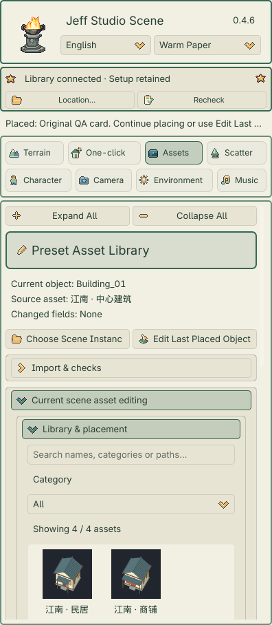
