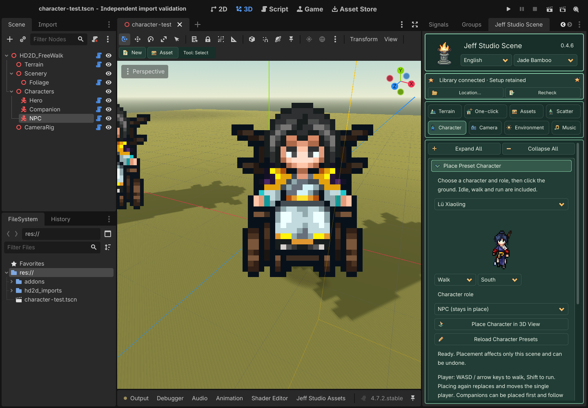

# Part III · Character

> **GitHub public edition:** The original 0.4.6 learning manual is retained below. The three extracted character presets, optional shared library and historical case packages are not bundled in this public release. Built-in buildings and terrain are included; use your own character assets. [Public distribution details](../../DISTRIBUTION.md)

0.4.6 fixes occasional scrambled character frames when starting, turning or switching between walking and running. Close Godot, update the plugin from package 01, then reopen the project. Existing characters receive the fix without reimporting images or placing them again.

Player placement defaults to orthographic follow. Preset character visuals face the camera including its pitch, preserving proportions in both projections. The body, feet and collision do not tilt. For manually imported legacy characters, enable Face Camera in Foot Anchor & Appearance, then apply the character settings.

Select an actor in the scene tree; Hero is the fallback target. Import each action and direction separately, click the feet in the image preview, then apply. One image cannot automatically supply all animations.

The three built-in presets now align to their visible soles so their feet do not sink into the ground after placement. Replace package 01 and reopen the scene: built-in characters still using the old default anchor receive a corrected local profile; save the scene to keep it. Custom anchors and manually imported characters retain their settings. No shared-library reinstall or raised character/collider position is needed.

## Characters near building walls

Face Camera keeps characters readable in orthographic and perspective views. Occlusion uses an upright depth plane on the camera-facing side of the existing collision footprint, anchored at the feet. This prevents the tilted visual from pushing the upper body into a wall and keeps small front eaves from clipping the head. Buildings still hide characters standing behind them. This correction applies to existing camera-facing characters and new placements. Close Godot, replace package 01, and reopen the project; case files and the shared library do not need replacement.

Collision radius and height control physical movement; the foot anchor controls image alignment with the ground. A stopped body with a clipped upper half indicates the visual occlusion issue above. If the entire actor can walk into a building, check its static collision shape, dimensions and offset. Enable Show Collision Guides in Assets → Static Collision to inspect the wall coverage.

These captures use the Case05 martial-hall model and character in an isolated scene with original-mesh collision. Camera and collision are identical in both images.

## Place Preset Characters

Open **Character → Place Preset Character**. The 0.4.6 local-study plugin package includes Wandering Swordsman, Leng Wuqing and Lv Xiaoling. No shared library or case package is required. Nine source images and the action index total about 179 KiB (about 154 KiB compressed). Selecting a preset prepares only its three sheets. Optional external characters are deduplicated by stable ID; a missing or damaged external index does not block builtins.

1. Choose Wandering Swordsman, Leng Wuqing or Lü Xiaoling. The plugin prepares only that character’s three sheets. Preview idle, walk and run in four directions.
2. Choose **Player (unique), Companion (follows player), or NPC (stays in place)** below the preview.
3. Click **Place Character in 3D View**, then click ground or a bridge. Esc cancels and each placement supports undo. Placing another player replaces and moves the same player instead of creating a second one.
4. Save and run or deliberately open Preview. In free-walk maps use WASD / arrows to walk and hold Shift to run. The game camera follows the player; the editor viewport stays free. Companions follow the recorded route and run to catch up. NPCs remain in place with idle animation.

Companions may be placed first and wait until a player exists. Following respects physics collisions and does not include obstacle pathfinding. Fix blocked routes or collisions when needed. Role placement is intended for free-walk maps; looping showcases retain their existing stage behavior.

Select a placed character to adjust the existing anchor, display, movement and collision controls, then click **Apply Character Settings / Foot Anchor**. Presets walk at 3.5 m/s and run at 6.5 m/s. Companion spacing defaults to 1.8 m and can be changed through the node’s `follow_spacing`. The placement role selector affects future placements only.

Prepared sheets live in the project’s `hd2d_imports/characters`; saved scenes run without the shared drive. Animations, speed, role and anchor are saved with the scene. East explicitly mirrors the supplied west view. These extracted game presets remain local-study assets, without a commercial-use grant.

0.4.6 · Bundled characters without a shared library: actions, roles and placement.

## Collapsible visual groups

Click a bordered heading to expand or collapse it. Common groups start open (★); your choice is remembered per project. **Expand All / Collapse All** only affects this page. Tab to a heading and use Enter/Space, or Left/Right. Hiding controls keeps drafts and active tools/audition; it neither applies settings nor saves the scene. Shared Apply buttons stay outside the folds.

| Group | Contains |
| --- | --- |
| ★ [Action & direction](#group-character-action) | Direction count, action/custom action, source direction and import FPS. |
| ★ [Asset import](#group-character-import) | PNG sequence, atlas grid/row/frame count and SpriteFrames import. |
| [Animation mapping](#group-character-mapping) | Map the selected action/direction to an existing animation name. |
| [Foot anchor & appearance](#group-character-appearance) | Foot preview and anchors, meters per pixel, shading and horizontal flip. |
| [Movement & collision](#group-character-movement) | Walk speed, collider radius/height and actor placement tool. |
| [Character shadows](#group-character-shadow) | Contact and flat-ground projected shadow toggles. |

**Action & direction**

**Asset import**

**Animation mapping**

**Foot anchor & appearance**

**Movement & collision**

**Character shadows**

## Buttons and operations

| Visible button | What it does / when it applies |
| --- | --- |
| Import PNG Sequence (natural name order) | Imports equal-canvas PNGs in natural name order into the current action/direction; set action, direction and FPS first. |
| Import This Atlas Row | Slices a row using the configured columns, rows and row index; does not infer irregular packed atlases. |
| Import Existing SpriteFrames | Loads a prepared SpriteFrames .tres/.res, not an asset library or character Profile; dependent images must be accessible. |
| Map Action / Direction to Animation | Maps the selected action/direction to the named existing animation; does not duplicate or generate frames. |
| Apply Character / Foot Anchor | Commits pivots, direction count, scale, movement, collision and shadows to the current actor profile; check foot alignment in Preview. |
| Place Character on Ground | Enters the actor placement tool; clicking the terrain moves the current actor rather than creating a new one each time. |

## Every parameter

Most numeric fields are drafts until the relevant Apply button is clicked. Tool settings are read when you paint/place; imports and file-selection actions run immediately. Apply is not a disk save: use Ctrl+S / Cmd+S afterward. Check the action descriptions for exceptions.

Ranges show minimum … maximum; step. Options show the available choices. Units and conditions are explained in the final column. Sliders and their numeric boxes edit the same value, not two separate parameters.

| Parameter | Initial default | Range / step / options | Meaning and limits |
| --- | --- | --- | --- |
| Direction count [Action & direction](#group-character-action) | 4 | 2, 4, 8 | Desired direction count, not the number of available images; missing directions produce warnings and fallbacks. |
| Action [Action & direction](#group-character-action) | idle | idle, walk, run | Action key currently being imported or mapped: idle for standing and walk for locomotion. |
| Source direction [Action & direction](#group-character-action) | s | s, w, n, e, sw, nw, ne, se | Actual source direction for this batch: s south, w west, n north, e east; remaining keys are diagonals. |
| Frames per second [Action & direction](#group-character-action) | 8 | 1 … 60; 1 | Playback frames per second for the imported action; higher values play faster, without generating in-between frames. |
| Atlas columns [Asset import](#group-character-import) | 4 | 1 … 128; 1 | Number of equal-width columns in a regular sprite atlas. |
| Atlas rows [Asset import](#group-character-import) | 4 | 1 … 128; 1 | Number of equal-height rows in a regular sprite atlas. |
| Row to read (starts at 1) [Asset import](#group-character-import) | 1 | 1 … 128; 1 | One-based row number to import; it must be within the atlas row count. |
| Frames in this row [Asset import](#group-character-import) | 4 | 1 … 128; 1 | Number of consecutive usable frames in this row; cannot exceed the column count. |
| Horizontal anchor [Foot anchor & appearance](#group-character-appearance) | 0.5 | -0.5 … 1.5; 0.01 | Horizontal normalized foot pivot: 0 left, 0.5 center, 1 right; different from atlas crop coordinates. |
| Foot anchor [Foot anchor & appearance](#group-character-appearance) | 1 | -0.5 … 1.5; 0.01 | Vertical normalized foot pivot; align to the visible soles, not blindly to the bottom of a transparent canvas. |
| Meters per pixel [Foot anchor & appearance](#group-character-appearance) | 0.025 | 0.001 … 0.1; 0.001 | World meters per source pixel. Display height is approximately image height in pixels times this value. |
| Walk speed (m/s) [Movement & collision](#group-character-movement) | 4 | 0 … 20; 0.1 | Basic movement speed in meters per second, independent of animation FPS. |
| Collision radius [Movement & collision](#group-character-movement) | 0.3 | 0.1 … 3; 0.05 | Capsule collider radius in meters; collision is separate from sprite rendering. |
| Collision height [Movement & collision](#group-character-movement) | 1.5 | 0.2 … 5; 0.05 | Total capsule height in meters, which should be at least its diameter; do not count transparent margins as body height. |
| Receive sunlight shading [Foot anchor & appearance](#group-character-appearance) | Off / 关 | — | Lets scene lighting shade the sprite; disabled gives more stable color but less scene-light response. |
| Manual horizontal flip (no new directions) [Foot anchor & appearance](#group-character-appearance) | Off / 关 | — | Manually mirrors existing images horizontally; does not create a missing directional animation. |
| Foot contact shadow [Character shadows](#group-character-shadow) | On / 开 | — | Contact shadow beneath the feet to communicate ground contact. |
| Flat-ground shadow (use cautiously on slopes) [Character shadows](#group-character-shadow) | Off / 关 | — | A projected-shadow approximation suited to flat ground; inspect slopes for floating or intersecting shadows. |
| Optional custom action (e.g. attack) [Action & direction](#group-character-action) | — | Text | Nonempty text overrides the action dropdown, e.g. attack. The basic walking controller is not a combat state machine; custom actions need game logic. |
| Existing animation, e.g. WalkSouth [Animation mapping](#group-character-mapping) | — | Text | Exact existing animation name inside SpriteFrames, not the resource file path. |

## Other visible controls

| Control | Explanation |
| --- | --- |
| Foot image and yellow baseline | Click the preview to set both pivots, then apply. Equal canvases across animations make consistent alignment easier. |
| Missing-direction warning | Lists missing animations and the actual fallback; does not generate frames or automatically mirror them. |

## Recommended sequence and pitfalls

Start with walk_e and check foot alignment, then add idle and other directions for which actual images exist. Test direction switching and slope collision with WASD/arrows. Legacy manually imported actors retain idle/walk; preset-role actors switch idle/walk/run with movement. This is not a complete combat-animation controller.

Use the shared toolbar reference for saving, stopping tools and previews. This workflow uses the dock, thumbnails, brush and native Inspector; you do not need to write GDScript to author the scene.

## Facing and mirroring

Preset actors automatically face the camera; do not tilt their root nodes. For manually imported actors, enable **Foot Pivot & Appearance → Face the camera** and apply. This corresponds to Profile's **Full Billboard** and affects only the visual.

Expand Profile in the actor's Inspector. **Mirror Directions** is an array of direction keys and defaults to empty. Adding `e` explicitly mirrors supplied frames for the east direction, as in Case 5. It combines with Flip H and never generates new frames. Unprovided directions without an explicit mirror still use animation-mapping fallbacks.

## Facing and running

| Parameter | Default | Range | Purpose |
| --- | --- | --- | --- |
| Face the camera (automatic for preset characters) | On for presets | On / Off | The visual follows camera pitch while feet and collision stay anchored. Enable and apply explicitly for legacy imported actors. |
| Run speed | 6.5 m/s | 0–30; step 0.1 | Hold Shift in a free map; preset run animation follows movement speed. |

The bundled game-extracted characters remain local-study material. A future public GitHub distribution must exclude `addons/hd2d_scene_tools/assets/local_study_characters` and its index. No repository is created or uploaded by this update.
