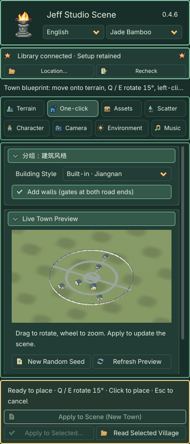
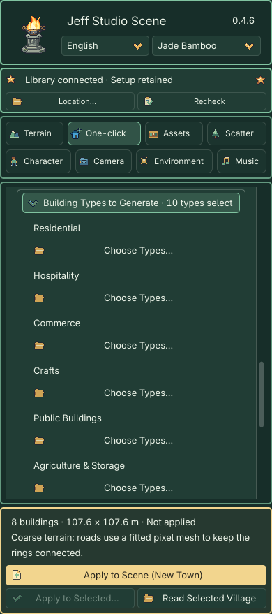

# One-click Generation: From Style to Town

> **GitHub public edition:** The original 0.4.6 learning manual is retained below. The three extracted character presets, optional shared library and historical case packages are not bundled in this public release. Built-in buildings and terrain are included; use your own character assets. [Public distribution details](../../DISTRIBUTION.md)

The 0.4.6 built-in generators need only the plugin. No shared library is required. Recipes retain parameters and seeds; applying saves actual meshes, materials and terrain inside your project.

## 1. Choose a building style

Create a free map under **Terrain → New Map**. Start with a 128 m map and 129 height samples per side. Open **One-click → Building Style** and choose **Built-in · Jiangnan / European / Desert Settlement**. The three styles share 10 categories and 46 functional types; the automatic town pool uses settlement-appropriate entries.

Position is chosen through the blueprint in the 3D viewport. The center selector and X/Z inputs have been removed. Apply, point to the location, rotate with Q / E, then left-click to confirm. Enable walls if desired. Older styles labelled Shared Library still require the historical optional library.

## 2. Inspect the draft

Drag to rotate and use the wheel to zoom; neither action regenerates models. Settings refresh after a short debounce. Preparation shows progress and retains the previous image with Apply disabled. Rapid selections discard stale tasks; leaving the module or changing scenes cancels them. Road, spacing and direction edits reuse buildings; appearance changes update materials only. With a valid terrain target, the preview includes the proposed grading and paving without changing the scene. Without terrain it is a style illustration; Apply is disabled.

## 3. Adjust the town

- Choose a one-sided street, two-sided street or concentric layout. Concentric layouts include one to three ring roads and two or four connecting streets, linked to building entrances, the center plaza and gates. Reduce the count or building size, or use larger terrain when space is insufficient.
- Choose a central plaza or building. The central building counts toward the 24-building limit.
- Open **Layout & Custom Buildings → Building Types to Generate** below the layout parameters. It starts collapsed and summarizes the selected count. Choose eligible types without percentage inputs. New classified towns use constrained per-type shapes. Refine an individual building in the workbench; legacy and custom palettes retain their existing controls.
- Layout, shape, detail and appearance seeds are separate. The Original, Elegant, Warm and Weathered looks preserve the geometry and placement.
- Local grading creates individual foundations with blended slopes. The height limit bounds terrain adjustment; move the town or edit the terrain when it is exceeded.
- Matching ground adds the selected style’s base tile only when the terrain has no image textures; existing texture slots remain intact.
- Paving can use an automatically allocated empty surface layer, a selected existing layer or a fitted pixel mesh. When the terrain sample spacing exceeds half the narrowest road width, Auto explicitly reports a switch to a fitted mesh to keep narrow paths and rings continuous. The mesh merges intersections and plaza paving. Sufficiently fine terrain still uses painted weights. With all eight layers full, choose an existing layer or mesh paving; existing textures are never overwritten.

## 4. Apply and save

Click the fixed gold **Apply to Scene (New Town)** button to enter **town blueprint placement** in the 3D viewport. This does not yet create scene objects or change the terrain.

1. Move the pointer over the current terrain to position the blueprint.
2. Press **Q / E** to rotate the entire town, roads and walls by **15°** per press.
3. Blue means the town can be placed. Red indicates a boundary, overlap or grading problem; the footer explains the cause. A brief checking state appears while moving.
4. **Left-click to confirm** and create the town with its grading and paving. **Esc cancels** without terrain changes or leftover objects. Changing module, scene or target, or losing window focus, also exits placement.

Village contains selectable buildings and walls. Painted roads become terrain weights; mesh paving becomes a saved node. Confirmation exits placement. One Undo restores the town, terrain, asset registration and associated grounding changes. The editor-only blueprint is never saved in the scene.

**Apply to Selected…** regenerates the existing town using its loaded and adjusted parameters; it does not start new-town placement.

Select a Village or its building and use **Read Selected Village** to continue. **Apply to Selected…** explains the replacement scope. Later manual edits overlapping the original grading stop replacement instead of being overwritten.

Save with Ctrl+S / Cmd+S. Reopening never regenerates the town automatically. Prepared scenes run offline. Recipes retain generator/preset versions, parameters and seeds; identical versions and inputs reproduce the same structure. Saved meshes do not depend on editor caches.

## Limits

Buildings are exteriors without rooms. Generation does not cross water, create bridges or edit partitioned world maps. Existing objects are retained; move the town when roads or foundations conflict. External shared assets retain their original provenance and usage labels.

## Revised buildings and existing towns

See the [nine revised House, General Store and Inn designs](assets.md#builtin-buildings) for actual renders. New buildings use v5 with original style atlases; v1–v4 retain their versioned reading and reproduction paths.

`hd2d_generated` contains applied project resources, not disposable caches. Back it up with your scenes; clearing `.godot` does not remove it.

## Make an individual building

Open **Asset Workbench → Built-in Buildings**, choose a style, category and specific building, then edit dimensions, floors, roof, windows, appearance and seeds with a live preview. **Place This Building** starts blueprint placement. **Add to Town Palette** adds the draft to One-click’s custom building palette. See [building parameters and instance editing](assets.md#builtin-buildings).

See [Built-in Buildings](assets.md#builtin-buildings) for detailed samples, seeded variants and explicit legacy upgrades. New v5 towns store their type pool, internal weights and individual recipes. Reading an old town retains its saved weights and models despite the removed inputs. Explicitly selecting a built-in style again opts into the default mix and new generator.

## Functional composition and two random levels

**Layout & Custom Buildings → Building Types to Generate** is initially collapsed with a selected-type count. Each **Choose Types…** menu controls its eligible types. Internal weights default to Residential 50, Hospitality 15, Commerce 15, Crafts 10 and Public Buildings 10. Empty categories are excluded; enabling Agriculture adds weight 10. Remaining weights are normalized; largest fractional remainders receive leftover slots. The exact requested count is retained: 20 buildings become 10 / 3 / 3 / 2 / 2.

The default pool contains Common House, Farmhouse, Inn, Tavern, General Store, Apothecary, Forge, Carpenter and the style's civic hall. A central building comes from enabled public types and consumes one public quota and total slot. Defense, transport and exploration types are placed individually through the workbench. No valid public choice means a visible warning rather than an extra building.

Layout Seed determines assignment and layout; Shape Seed determines structural variants; Detail Seed determines local features; Appearance Seed changes pixel textures. New towns use per-type shapes. Refine one building through Read Selected Building in the workbench. Old recipes and custom palettes retain their original controls.

**Random Building** changes structure and details; **Randomize Details Only** preserves body, windows, entrance and collisions; **Reproduce from Seeds** refills random parameters using the current seeds. Manual edits require saving the complete recipe. See [the building catalog](assets.md#builtin-buildings).

