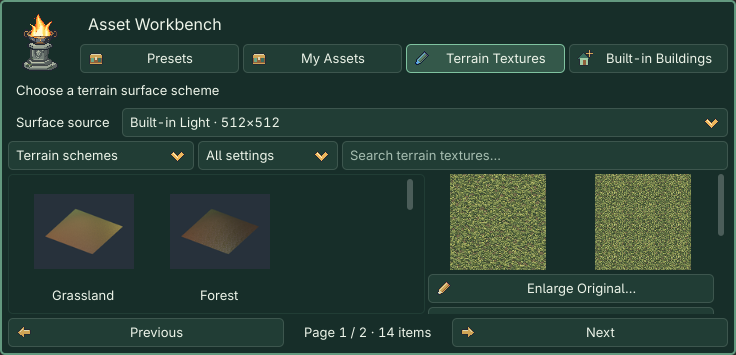

# Part III · Terrain

> **GitHub public edition:** The original 0.4.6 learning manual is retained below. The three extracted character presets, optional shared library and historical case packages are not bundled in this public release. Built-in buildings and terrain are included; use your own character assets. [Public distribution details](../../DISTRIBUTION.md)

**Set map specifications → Choose a surface → Inspect the right-side preview → Apply at the bottom.** Existing terrain can be sculpted and painted directly.

## Terrain Creation Guide

The first section displays a live terrain preview of the new-map draft, or the current terrain with its surface draft. **Map Settings…** opens settings. Inspect terrain directly here; use **Camera → Preview Scene** when you want an isolated run.

The gold-bordered Apply frame stays outside the scrolling operations area, with a pale-yellow primary button. It shows **Apply: Create Map** for a new draft, or **Apply Surface Settings** for existing terrain. The preview uses a simplified mesh; creation uses your requested sample count. Sculpting and painting change the scene directly. Apply commits a new map or surface draft; save with Cmd+S / Ctrl+S.

## Collapsible visual groups

Click a heading to toggle. ★ starts open; the project remembers your choices. **Expand All / Collapse All** affects this page only. Tab to a heading, then use Enter/Space or Left/Right. Folding keeps drafts and active tools without applying or saving.

| Group | When it takes effect |
| --- | --- |
| [New Map](#group-terrain-template) | Set specifications and surface, then Apply: Create Map in the dock footer. |
| ★ [Terrain sculpting](#group-terrain-brush) | Hold the left mouse button in the native 3D viewport to edit height. |
| [Surface layers & painting](#group-terrain-layers) | Choose textures into a draft; apply before painting blend weights. |
| [Terrain conformance](#group-terrain-conform) | Automatically or manually update linked plants and roads after sculpting. |
| [Terrain Creation Guide](#group-terrain-world) | New-map/current-terrain preview, and map specifications. |

**New Map**

**Terrain sculpting**

**Surface layers & painting**

**Terrain conformance**

****

## 1. Create a map

Both **New Map…** entries open the same dialog. Defaults are **Free map, 64 meters, 129 samples per side**, giving **0.5-meter spacing**. 64 m means **both X and Z sides are 64 m**, an area of 64×64 m². Samples store elevation, not a maximum height. 129 per side means 16,641 points in total. **Spacing = side length ÷ (samples − 1).**

Select **Custom…** for either value: side length 1–4096 m in 0.5 m steps, samples per side 3–513 in integer steps. For example, 75.5 m / 100 samples gives about 0.763 m spacing. Denser grids capture finer slopes and cost more memory and editing time. At the bottom choose **Use Solid Colors**, or **Choose Preset Scheme…** and click a scheme in the workbench. Settings close with parameters retained. Inspect the right-side preview and click **Apply: Create Map** in the dock footer. Choosing a scheme does not create a scene or reopen settings. The settings window’s × abandons the new-map draft.

Each creation saves an independent scene and external terrain resource under levels. Existing filenames get a unique suffix. This does not resize, resample or clear existing terrain. Save As still does not duplicate all referenced resources.

### Lakes, rivers, seas and volcanoes

**Landform** offers Flat Ground, Lake and Shore, Winding River, Coast and Beach, Sea and Island, and Volcanic Crater. The right side previews the shape independently; creation uses your sample count. Landform presets use free maps. Loop stages use flat ground so scrolling scenery stays aligned.

1. Select a landform.
2. Keep **Create Separate Water / Lava** enabled if wanted and set animation speed; speed 0 pauses it.
3. Click **Choose Preset Scheme…** and select a lakeshore, riverbank, coast, island or volcano scheme in the workbench, or choose **Use Solid Colors**. Inspect the right preview, then click **Apply: Create Map** in the dock footer. Built-in presets and solid colors both work without a shared library.
4. Continue sculpting and painting. Select **Water / Lava** in the scene tree. In the Inspector, Position Y controls water level, Extent controls coverage, Animation Speed controls motion, and Water Color / Lava Color controls color. Sculpting does not automatically change water level.

Water and lava are animated visuals without fluid simulation, swimming, buoyancy or damage. The surface has no collision; characters still stand on the heightfield. Add gameplay logic for swimming or lava damage.

**Lake and Shore**

**Winding River**

**Coast and Beach**

**Sea and Island**

**Volcanic Crater**

## 2. Sculpt height

**Edit existing terrain directly; you do not need to create another map.** Select its HD2DStage or HD2DTerrain in the scene tree, then sculpt or paint. Native mesh floors such as Case05 are not sculptable heightfields.

**Show Terrain Only (Temporary)** at the top of the Terrain page hides buildings, characters, foliage, roads, water/lava and scene UI, while retaining terrain, lighting and the brush cursor. Newly created scenery is hidden too. Turn it off, leave the Terrain page, switch scenes or disable the plugin to restore the view. Objects originally hidden remain hidden. This affects the editor view only: saved scenes, the game and isolated previews keep their normal visibility. No Apply action is needed.

| Tool | Behavior |
| --- | --- |
| Raise / Lower | Adds or subtracts height per second, strongest at the brush center. |
| Smooth | Reduces neighboring height differences without resetting the ground. |
| Flatten | Gradually approaches the target height; entering a value alone does nothing. |
| Ramp | Connects the initial height to the dragged endpoint's target along a continuous corridor. No drag direction means no ramp. |

Raise, Lower, Smooth, Flatten and painting work while **holding the mouse still**. Strength accumulates with time. Release, Esc or focus loss ends the stroke; one stroke is one undo. Sculpt and paint settings are remembered separately. Only Flatten/Ramp show target height.

Terrain tools hit the current heightfield behind scene props. Use the native 3D editor, not the isolated preview. Keeping terrain at the origin with scale 1 makes meter-based authoring easier.

## 3. Choose built-in surfaces

Use **Terrain → Surface layers & painting → Choose Preset Texture… / Choose Terrain Scheme…**, or **Asset Workbench → Terrain Textures**.

Package 01 now includes **35 original 512×512 terrain textures and 14 schemes**. No shared library is required. Lightweight textures occupy about 18.1 MiB; thumbnails and the index bring this to 19.6 MiB. Nearest-neighbor downsampling preserves hard pixel edges. Tiling periods and stable IDs are unchanged. The original 1024×1024 files remain in the shared library.

Browsing reads only the index and current-page thumbnails. Startup does not import all original images. Selecting a texture or scheme prepares only its images under `hd2d_imports/terrain`; identical content is reused. Keep that folder with your saved scenes. Runtime does not need an external library.

**Surface source** defaults to **Built-in Light · 512×512**. For full-size textures, connect the library through **Location…**, then choose **Shared Originals / Extensions · 1024×1024**. Sources are browsed separately. Switching sources never replaces applied textures automatically. If the external library is unavailable, switch back to built-ins.

1. Browse single textures or complete schemes using scene filters, search and pages. Per-layer entry points identify the target layer.
2. Selection prepares resources, immediately selects the draft and updates the preview: original image, 3×3 repeat and isolated terrain. **Enlarge Original…** opens the large image. Switch between **Soft Lighting Preview / Albedo Preview (Unlit)** to separate texture color from lighting. This does not change scene lighting.
3. No extra Use or Cancel Selection action is required. Cards show the actual name, thumbnail and unapplied state.
4. Adjust the shared tiling period: **larger values make texture features larger**. **Apply Surface Settings** in the dock footer commits the changes together; **Revert Unapplied Changes** discards them.
5. Click a layer card, then **Paint Layer N**. Apply or revert pending changes first. Replacing textures preserves heights and painted distribution.

35 original 512×512 PNGs form 14 schemes. Shore schemes reuse appropriate textures in the following order:

| Scheme | Texture order |
| --- | --- |
| Grassland | Short grass, Yellow-green grass, Bare earth, Fine gravel earth |
| Forest | Mossy grass, Forest humus, Leaf litter, Mossy stone |
| Farmland | Field-edge grass, Tilled soil, Dry earth, Earth path |
| Old town | Blue flagstone, Rammed earth, Old brick paving, Gravel path |
| Mountain | Gray limestone, Weathered rock, Mountain scree, Sparse grass earth |
| Desert | Fine sand, Wind-rippled sand, Cracked earth, Sandstone |
| Snowland | Fresh snow, Packed snow, Frozen earth, Frosted rock |
| Wetland | Wet grass, Silt mud, Wet sand, Wet pebbles |
| Volcano | Basalt, Volcanic ash, Cooled lava crust (3 layers) |
| Lakeshore | Mossy grass, Wet pebbles, Silt mud (3 layers) |
| Riverbank | Short grass, Wet sand, Wet pebbles (3 layers) |
| Coast | Sparse grass earth, Fine sand, Wet sand (3 layers) |
| Island | Short grass, Fine sand (2 layers) |
| Snow plain | Fresh snow (1 layer) |

These textures were newly made with imagegen, referring to broad pixel-art wuxia characteristics without copying, collaging or simply recoloring extracted originals. Permission for commercial use and raw redistribution of those originals has not been established. New terrain provenance is separate. **Existing extracted models, music and screenshots remain private local-study content; the complete shared package is not a commercial asset pack.**

## 4. Paint and maintain terrain

Flat ground initially uses layer 1 everywhere. Applying that image shows the base immediately; other layers appear where painted. This is conventional terrain texture painting: textures blend on one surface by weight. Layer numbers do not control stacking. Increasing one weight reduces the others. Paint layer 1 to restore the base. Landform recipes already paint upland, bank and bed distributions.

The default four layers cover combinations such as grass, soil, rock and paths; games have no universal four-layer limit. Use **Add Surface Layer (up to 8)** when a complex area needs more, apply, then paint the new layer. Layers 5–8 require extra weights and texture sampling. Existing four-layer terrain keeps its original material path. A new map using a 1–3 texture scheme has that many layers. Applying a shorter scheme to an existing map replaces only its corresponding slots and retains the other layers and painted distribution.

Fresh snow, packed snow, fine sand and wind-rippled sand have been redrawn. Compare the albedo and soft-lighting previews; if the actual scene washes out, inspect its environment and light intensity.

**Auto-conform after sculpting** starts enabled. Height edits update linked plants and roads in the same undo action. Texture painting never conforms scenery. With automatic conformance off, **Snap Plants and Roads to Terrain** is a separate undoable action.

Old composite materials remain unchanged. Inspect **Preview Four Surface Layers**, then click **Apply Surface Settings** in the dock footer. Conversion retains four slots, heights and weights without baking the old material. Appearance changes; one undo restores it.

Applying is not saving. Press **Cmd+S / Ctrl+S**, then reopen to inspect strokes. Switching terrain clears unapplied drafts; undo and redo synchronize the cards.

## Every parameter

| Parameter | Initial default | Range / step / options | Meaning |
| --- | --- | --- | --- |
| Map type | 自由地图 / Free map | 自由地图／循环舞台 · Free / Loop | New maps only. |
| Map side length (m) | 64 | 64, 128, 256, 512; custom 1–4096 / 0.5 | Length on both X and Z; new maps only. |
| Samples per side | 129 | 129, 257, 513; custom 3–513 / 1 | Spacing=size÷(samples−1). |
| Show Terrain Only (Temporary) | Off | On / Off | Temporary editor view; never saved into the scene. |
| Sculpt radius (m) | 4 | 0.2 … 64; 0.1 | Radius, not diameter. |
| Sculpt strength / second | 3 | 0.05 … 30; 0.05 | Height or approach rate per second. |
| Flatten / ramp endpoint height | 2 | -50 … 100; 0.1 | Terrain-local height in meters. |
| Active layer card | 1 | 1–8 | Actual image name; empty slots show Unset (plain color). |
| Texture repeat period (m) | 2 | 0.1 … 32; 0.1 | Shared by all layers; requires Apply. |
| Paint radius (m) | 4 | 0.2 … 64; 0.1 | Remembered separately from sculpting. |
| Paint strength / second | 3 | 0.05 … 30; 0.05 | Changes weights, never height. |
| Auto-conform after sculpting | 开启 / On | 开／关 · On / Off | Remembered per project. |

This version provides fixed landforms and simple animated water/lava visuals. It does not resample existing maps or add random generation, caves, overhangs, LOD or fluid simulation. Start at 64 m / 129 samples; larger grids cost more. Loop stages with height changes along the scrolling axis still need scenery/ground alignment checks.
