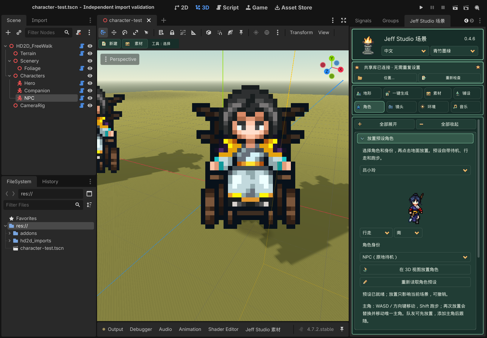

# 第三部分 · 角色

<!-- manual-navigation:start -->
[项目首页](../../../README.md) / [说明书总目录](../../README.md) / [中文说明书](../index.md) / [功能指南](README.md)

[← 返回上一级](README.md) · [English](../../en/reference/character.md)

本页目录（点击展开）

- [角色贴近建筑时的遮挡](#manual-section-01)
- [放置预设角色](#manual-section-02)
- [可折叠功能分组](#manual-section-03)
- [按钮与操作](#manual-section-04)
- [逐项参数](#manual-section-05)
- [其他可见控件](#manual-section-06)
- [操作顺序与常见误区](#manual-section-07)
- [显示方向与镜像](#manual-section-08)
- [显示与跑步](#manual-section-09)

<!-- manual-navigation:end -->

> **GitHub 公开版说明：**下文保留 0.4.6 原学习版说明。三位游戏提取角色预设、可选共享素材库与历史案例包未随公开版提供；内置建筑与地表已包含，角色可使用自己的素材。[查看分发说明](../../DISTRIBUTION.md)

0.4.6 已修复角色起步、转向及切换跑步时偶发的乱帧或贴图块。关闭 Godot 后更新第一包中的插件，再打开工程即可；已放置角色直接生效，无需重新导入图片或重新摆放。

主角默认使用正交跟随镜头。预设角色的显示面自动朝向镜头俯仰，避免正交／透视俯视时显得矮；角色根节点、脚底和碰撞不会随镜头倾斜。旧手动导入角色可在“脚底锚点与显示”开启“角色画面正对镜头”，再应用配置。

在场景树选择角色；未指定时使用 Hero。按每个动作和方向分别导入图片，在预览图点击脚底，然后应用。并不是导入一张图就能自动补齐所有动作。

三个预设角色的脚底已校准到可见鞋底，避免放置后脚部埋入地面。更新第一包后重新打开场景即可：仍使用旧默认锚点的预设角色会在本地副本中修正，保存场景保留结果；已手动修改的锚点与自行导入的角色保持原设置。无需重装共享素材包，也不需要抬高角色节点或碰撞体。

## 角色贴近建筑时的遮挡

开启“角色画面正对镜头”后，角色保留正交和透视镜头下的完整比例；与墙面、建筑的遮挡以脚底为基准，在碰撞体朝向镜头的一侧计算显示深度，避免贴近屋檐边缘时头顶被切掉。这样贴近墙面时，上半身不会因显示面向后倾斜而插入墙内，走到建筑后面仍会被正常遮挡。已有案例和新放置角色都使用此修正；关闭 Godot、替换第一包插件后重新打开工程即可，不需要改案例或共享素材包。

碰撞半径、碰撞高度决定身体能否通过；脚底锚点决定图片从哪里落地。如果身体已停住，仅上半身被截断，是上述显示遮挡问题。若整个角色能走进建筑，请检查建筑是否启用静态碰撞，以及碰撞形状、尺寸、偏移是否覆盖墙体；在“素材 → 静态碰撞”开启“显示碰撞参考线”核对。不同问题需要分别调整。

以下使用案例 5 的武馆模型与角色，在独立场景中以原网格碰撞对比；机位和碰撞保持相同。

## 放置预设角色

打开 **角色 → 放置预设角色**。0.4.6 学习版第一包已内置斗笠侠客、冷无情、吕小玲，无需共享库或案例包。9 张原图及动作索引约 179 KiB，ZIP 中约 154 KiB；选择时只准备当前角色的三张图片。外部角色作为可选扩展，同标识不会重复列出，库断开或索引损坏不影响内置角色。

1. 下拉选择斗笠侠客、冷无情或吕小玲，等待动作预览。只准备所选角色的三张图片，不导入整个素材库；可切换待机、行走、跑步和四个方向检查动作。
2. 在预览下方选择身份：**主角（唯一）／队友（跟随主角）／NPC（原地待机）**。
3. 点击 **在 3D 视图放置角色**，再点击地面或桥面。Esc 取消；每次放置可以撤销。再次放置主角会替换同一个主角的外观并移动位置，不会增加第二个主角。
4. 保存场景，主动预览或运行。自由地图中主角用 WASD／方向键行走，按住 Shift 跑步；镜头跟随主角，编辑器的自由视角不受影响。队友沿主角经过的路线跟随，距离较远时跑步追赶。NPC 在原位播放待机。

队友可以先于主角放置；没有主角时保持待机。跟随使用实际物理碰撞，不包含自动绕障寻路；主角穿过不可通行的障碍时，应先修正场景碰撞或道路。此版本的角色身份放置面向自由地图，循环展示仍沿用原有舞台行为。

**修改角色：** 选中场景中的角色，在原有“脚底锚点与显示”“行走与碰撞”中调整，再点击“应用角色配置 / 脚底锚点”。行走默认 3.5 米／秒，跑步默认 6.5 米／秒，队友默认间距 1.8 米；间距可在队友节点的 `follow_spacing` 调整。身份用于新放置，切换下拉框不会改写已放置物件。

角色资源按内容哈希进入工程内 `hd2d_imports/characters` 后，保存场景即可断开共享库继续运行。动画帧、速度、身份和原点随场景保存，不依赖开发者目录。东侧明确使用西侧素材镜像；这些游戏提取预设继续标为本机学习素材，不代表可商用授权。未来 GitHub 公开分发将排除 `addons/hd2d_scene_tools/assets/local_study_characters` 及其索引；本轮不上传。

0.4.6 · 无共享库的内置角色、动作、身份与放置。

## 可折叠功能分组

点击带边框的标题展开或收起。★为首次默认展开，之后记住本工程的选择。**全部展开／全部收起**只作用于当前页。可用Tab聚焦标题，Enter/Space切换，左/右键收起或展开。收起保留草稿和正在使用的工具／试听，不会应用或保存；跨组“应用”按钮保留在方框外。

| 分组 | 包含功能 |
| --- | --- |
| ★ [动作与方向](#group-character-action) | 方向数量、动作/自定义动作、素材方向与导入FPS。 |
| ★ [素材导入](#group-character-import) | PNG序列、规则图集行列/读取行/有效帧、SpriteFrames导入。 |
| [动画映射](#group-character-mapping) | 输入已有动画名，将当前动作/方向映射到该动画。 |
| [脚底锚点与显示](#group-character-appearance) | 脚底预览与锚点、每像素米数、受光和水平翻转。 |
| [行走与碰撞](#group-character-movement) | 移动速度、碰撞半径/高度、点击地面放置角色工具。 |
| [角色阴影](#group-character-shadow) | 脚下接触阴影和平地投影阴影开关。 |

**动作与方向**

**素材导入**

**动画映射**

**脚底锚点与显示**

**行走与碰撞**

**角色阴影**

## 按钮与操作

| 界面按钮 | 作用 / 何时生效 |
| --- | --- |
| 导入 PNG 序列（按名称自然排序） | 把多张等画布 PNG 按自然名称顺序导入当前动作/方向；先设置动作、方向与 FPS。 |
| 导入规则精灵图集的这一行 | 按列数、行数和所选行切出一组帧；不支持直接猜解不规则打包图集。 |
| 导入现有 SpriteFrames | 载入已准备好的 SpriteFrames .tres/.res；不是素材库或角色 Profile。外部依赖图片需可访问。 |
| 将所选动作 / 方向映射到此动画 | 把当前动作/方向映射到输入的已有动画名；不复制或自动生成动画帧。 |
| 应用角色配置 / 脚底锚点 | 提交锚点、方向数、大小、速度、碰撞与阴影到当前角色配置。修改后在隔离测试检查脚底。 |
| 点击地面放置角色 | 进入角色落点工具，点击地形调整当前角色位置；不是每次点击新增一个角色。 |

## 逐项参数

多数数值先留在面板草稿，点击对应“应用”才提交。笔刷参数在绘制时读取；导入和选择纹理等动作立即执行。应用不等于磁盘保存，最后按 Ctrl+S / Cmd+S。例外以各按钮说明为准。

范围列中“最小值 … 最大值；步长”对应控件限制；下拉框列出可选值。单位和前提写在含义列。滑块与右侧数字框是同一个参数的两种输入方式。

| 参数 | 初始默认 | 范围 / 步长 / 选项 | 含义与限制 |
| --- | --- | --- | --- |
| 方向数量 [动作与方向](#group-character-action) | 4 | 2,4,8 | 角色希望使用的方向数量，不等于已有图片数量；缺少的方向会提示并回退。 |
| 动作 [动作与方向](#group-character-action) | idle | idle,walk | 当前导入或映射的动作键：idle 为待机、walk 为行走。 |
| 素材方向 [动作与方向](#group-character-action) | s | s,w,n,e,sw,nw,ne,se | 当前这批原图实际朝向：s 南、w 西、n 北、e 东；其余为对角方向。 |
| 每秒帧数 [动作与方向](#group-character-action) | 8 | 1 … 60; 1 | 导入动作的每秒帧数，数值高播放更快；不是新增补间帧。 |
| 图集列数 [素材导入](#group-character-import) | 4 | 1 … 128; 1 | 规则图集水平方向的等宽格数。 |
| 图集行数 [素材导入](#group-character-import) | 4 | 1 … 128; 1 | 规则图集竖向的等高格数。 |
| 读取第几行（从 1 开始） [素材导入](#group-character-import) | 1 | 1 … 128; 1 | 本次导入的行号，从 1 开始；必须位于总行数内。 |
| 此行有效帧数 [素材导入](#group-character-import) | 4 | 1 … 128; 1 | 此行实际使用的连续帧数，不能超过列数。 |
| 横向锚点 [脚底锚点与显示](#group-character-appearance) | 0.5 | -0.5 … 1.5; 0.01 | 精灵横向脚底中心比例；0 左、0.5 中、1 右，和裁框坐标不同。 |
| 脚底锚点 [脚底锚点与显示](#group-character-appearance) | 1 | -0.5 … 1.5; 0.01 | 精灵脚底的竖向比例；按可见脚底定位，不按透明画布最下缘猜测。 |
| 每像素米数 [脚底锚点与显示](#group-character-appearance) | 0.025 | 0.001 … 0.1; 0.001 | 一个图片像素对应多少世界米。显示高度约等于像素高度乘此值。 |
| 行走速度 米/秒 [行走与碰撞](#group-character-movement) | 4 | 0 … 20; 0.1 | 基础行走速度，单位米/秒；不是精灵动画 FPS。 |
| 碰撞半径 [行走与碰撞](#group-character-movement) | 0.3 | 0.1 … 3; 0.05 | 胶囊碰撞体半径，单位米；碰撞与图片显示独立。 |
| 碰撞高度 [行走与碰撞](#group-character-movement) | 1.5 | 0.2 … 5; 0.05 | 胶囊总高度，单位米，应至少为直径；注意不要用透明留白估算身体高度。 |
| 角色接受日光明暗 [脚底锚点与显示](#group-character-appearance) | Off / 关 | — | 让精灵受场景日光影响；关闭时颜色更稳定，但不像实体模型那样受光。 |
| 手动水平翻转（不补造方向） [脚底锚点与显示](#group-character-appearance) | Off / 关 | — | 手动水平镜像已有图片；不会创建缺失的另一方向动画。 |
| 脚下接触阴影 [角色阴影](#group-character-shadow) | On / 开 | — | 角色脚下的接触阴影，帮助表达落地位置。 |
| 平地投影阴影（倾斜坡面慎用） [角色阴影](#group-character-shadow) | Off / 关 | — | 适合平地的投影阴影近似；斜坡可能漂浮或穿地，需要检查。 |
| 可选：自定义动作名（如 attack） [动作与方向](#group-character-action) | — | Text | 填写后覆盖动作下拉选择；如 attack。基础行走组件不是战斗状态机，自定义动作需游戏逻辑接入。 |
| 现有动画名称，如 WalkSouth [动画映射](#group-character-mapping) | — | Text | 现有 SpriteFrames 中的动画名称，必须精确匹配；不是资源文件路径。 |

## 其他可见控件

| 控件 | 说明 |
| --- | --- |
| 脚底图片与黄线 | 点击预览设置横/竖锚点，再应用角色配置；全动作等画布才更容易保持对齐。 |
| 缺失方向提示 | 列出缺失动画及实际回退；不是错误补帧服务，不自动镜像。 |

## 操作顺序与常见误区

先处理一组 walk_e 并检查脚底，再补 idle 和其他真实方向。预览用 WASD/方向键测试方向切换与斜坡碰撞。手动导入的旧角色沿用 idle/walk；预设身份角色按移动状态切换 idle/walk/run。这不是完整的战斗动作播放器。

保存、退出笔刷和预览请看顶部工具栏说明。这里使用侧栏、缩略图、笔刷和原生 Inspector 完成布景，不要求用户编写 GDScript。

## 显示方向与镜像

预设角色自动正对镜头，不需要旋转角色根节点。手动导入角色可在 **脚底锚点与显示 → 角色画面正对镜头** 开启并应用；它对应 Profile 的 **Full Billboard**，只影响画面。

在角色 Inspector 展开 Profile，**Mirror Directions** 是需要镜像的方向键数组，默认空。填 `e` 可用已有帧镜像东向，案例 5 使用此设置；它与 Flip H 共同决定翻转，不生成新帧。未提供也未明确镜像的方向仍使用动画映射回退。

## 显示与跑步

| 参数 | 默认 | 范围 | 用途 |
| --- | --- | --- | --- |
| 角色画面正对镜头 | 预设角色开启 | 开／关 | 显示面随镜头俯仰转动；脚底与碰撞保持原位。旧手动角色需主动开启并应用。 |
| 跑步速度 | 6.5 米/秒 | 0–30；步长 0.1 | 自由地图按住 Shift 使用；预设跑步动画随速度切换。 |

---

[← 上一章：铺设与道路](scatter.md) · [↑ 返回上一级](README.md) · [说明书总目录](../../README.md) · [↑ 回到页首](#manual-top) · [下一章：镜头 →](camera.md)
