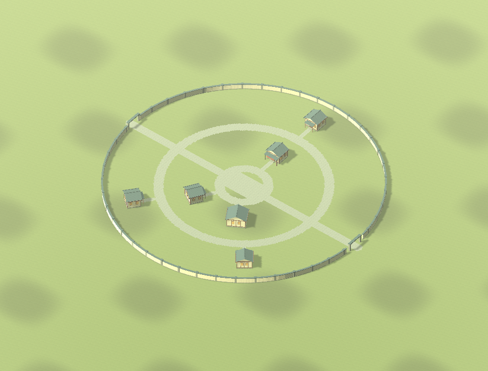
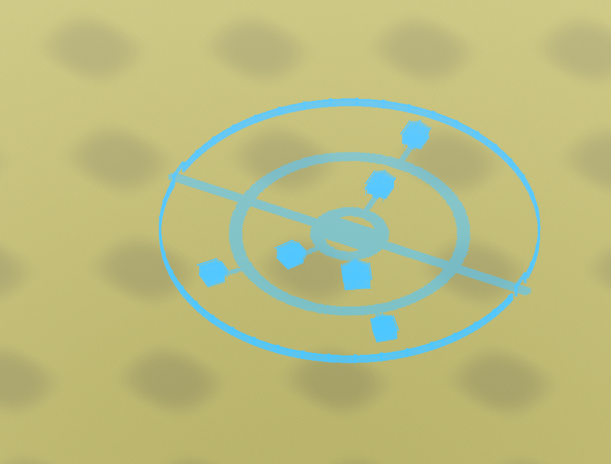
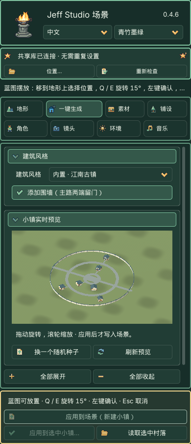
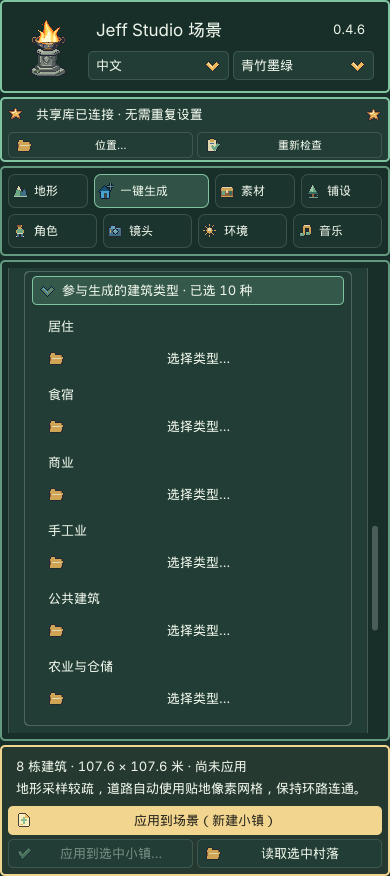

# 一键生成：从风格到小镇

<!-- manual-navigation:start -->
[项目首页](../../../README.md) / [说明书总目录](../../README.md) / [中文说明书](../index.md) / [功能指南](README.md)

[← 返回上一级](README.md) · [English](../../en/reference/generation.md)

本页目录（点击展开）

- [1. 选择建筑风格](#manual-section-01)
- [2. 查看预览](#manual-section-02)
- [3. 调整布局、建筑与外观](#manual-section-03)
- [4. 应用与保存](#manual-section-04)
- [边界](#manual-section-05)
- [新版建筑与旧小镇](#manual-section-06)
- [单独制作一栋建筑](#manual-section-07)

<!-- manual-navigation:end -->

> **GitHub 公开版说明：**下文保留 0.4.6 原学习版说明。三位游戏提取角色预设、可选共享素材库与历史案例包未随公开版提供；内置建筑与地表已包含，角色可使用自己的素材。[查看分发说明](../../DISTRIBUTION.md)

0.4.6 的内置生成器只需要插件，无需共享素材库。它保存建筑参数和随机种子，应用后将实际模型、材质与地形留在当前工程。

## 1. 选择建筑风格

先在 **地形 → 新建地图** 创建自由地图。初次尝试建议 128 米、129 个高度采样点。进入 **一键生成 → 建筑风格**，选择 **内置 · 江南古镇／欧式风格／沙漠聚落**。三种风格共用 10 大类、46 个功能条目；小镇自动池使用其中适合聚落的类型。

位置统一通过 3D 视图中的蓝图选择，不再设置“中心位置”或 X/Z 坐标。点击应用后，鼠标选择落点、Q / E 旋转，左键确认。按需开启围墙。名称带“共享库”的旧风格需要另行安装历史共享素材包。

## 2. 查看预览

右侧显示草稿，可拖动旋转、滚轮缩放；旋转和缩放不重新生成模型。修改参数后短暂等待即可自动刷新，准备中显示建筑进度并保留上一幅预览，应用暂时禁用。快速换选会取消过期任务；离开模块或切换场景也会取消。道路、间距和方向调整复用建筑模型，换皮只更新材质。选中有效地形时，预览包含局部整地与铺装，尚未修改场景。未选地形时只显示风格示意，并禁用应用。

## 3. 调整布局、建筑与外观

- **小镇排布**：单排、双排或中心环绕。环绕包含一至三圈环路、两条或四条贯通道路，并接到各栋建筑的入口、中心广场和城门。空间不足时减少数量、缩小建筑或换更大的地形。
- **城镇中心**：中心环绕可选广场或中心建筑；中心建筑计入最多 24 栋。
- **参与生成的建筑类型**：位于布局参数下方，默认收起，标题显示已选类型数。展开后按类别点击“选择类型…”勾选即可，不需要调整百分比。内部分配为居住 50、食宿 15、商业 15、手工业 10、公共建筑 10；关闭某类全部类型后自动排除并归一化。农业默认关闭，勾选后按内部权重 10 加入分配。总数始终等于建筑数量；默认 20 栋为 10／3／3／2／2。
- 默认池：普通民居、农舍、客栈、酒馆、杂货铺、药铺、铁匠铺、木工作坊及本风格议事厅／市政厅／议事院。中心建筑从勾选的公共类型抽取，占用公共配额和总数；未启用公共类型时会提示。城防、交通和探索类通过工作台单栋摆放，不进入普通小镇随机池。
- 新版小镇按各类型约束生成外形；需要精调单栋尺寸、楼层、窗列时，在工作台“读取选中建筑”后调整。旧配方与自定义组合保留原有控制。
- **随机种子**决定布局；**外形种子**决定各栋结构；**细节种子**决定门窗和用途细节；**外观种子**决定像素纹理。它们互不代替。
- **建筑外观**：原色、素雅、暖色、风化。换皮保持位置与形状。
- **预览局部整地**：为各栋建筑创建地基与坡面过渡。最大地基高差限制本次可调整的高度；超限时换位置或手动整地。
- **纯色地表使用配套底材**：为尚未设置图片的地表添加本风格底材；已有地表纹理不替换。
- **道路铺装**：自动分配空层、使用已有层、贴地像素铺装网格。自动模式发现地形采样间距大于最窄道路宽度的一半时，会提示并使用贴地网格，避免环路与入户小路断续。网格将路口、广场合为同一张铺装，不重复叠面；足够细的地形仍使用权重绘制。八层占满且未触发网格模式时，请选择已有层或主动切换网格；不会覆盖已有纹理。

## 4. 应用与保存

点击底部金色 **应用到场景（新建小镇）**，进入 3D 视图中的**小镇蓝图摆放**，此时还未修改地形或生成正式物件。

1. 将鼠标移到当前地形上，蓝图跟随鼠标选择位置。
2. 按 **Q / E** 每次左转／右转 **15°**，建筑、道路和围墙一起旋转。
3. 蓝色表示可放置；红色表示越界、冲突或整地条件不满足，底部提示具体原因。移动时会短暂显示检查中。
4. **单击鼠标左键确认**，才创建 Village 并提交整地与铺装；**Esc 取消**，不会留下蓝图或整地修改。切换模块、场景、目标或窗口失焦也会退出摆放。

生成的 Village 内有可选中的建筑与围墙，地表道路写入地形权重；网格铺装模式保存单独铺装节点。确认后退出摆放，一次撤销恢复小镇、地形、素材登记与关联贴地修改。蓝图只是编辑器辅助显示，不保存到场景。

已有小镇的 **应用到选中小镇…** 按读入后调整的参数重新生成，不进入新建摆放。

选择现有 Village 或建筑，点 **读取选中村落** 可继续调整；**应用到选中小镇…** 会先说明替换范围。已人工修改的原整地范围会阻止覆盖，不会静默抹掉。

Ctrl+S / Cmd+S 保存场景。再次打开不会自动重建，完全准备并保存的工程可以离线运行。保存的配方包括生成器版本、预设版本、参数与种子；相同版本和输入可重复生成相同结构。导出的实际模型不依赖编辑器缓存。

## 边界

内置建筑为外观模型，没有室内房间。自动生成不跨越水面，不制作桥梁，也不接入分区大地图。已有普通物件保留；地基或道路与关联物件冲突时，请先调整位置。原始共享素材仍保持其原有来源与使用标识。

## 新版建筑与旧小镇

九套新版普通民居、杂货铺和客栈的真实画面见[内置建筑](assets.md#builtin-buildings)。新版模型采用 v5 生成器和原创风格图集；旧 v1–v4 仍按原版本读取与重现。

应用后生成的 `hd2d_generated` 是工程资源，不是缓存。请随场景备份，勿删除；清除 `.godot` 编辑器缓存不会删除它。

## 单独制作一栋建筑

打开 **素材工作台 → 内置建筑**，选择风格、建筑大类与具体建筑，实时查看外形与皮肤；可修改宽深、楼层、屋顶、门窗和随机种子。点 **摆放此建筑** 用蓝图选择位置。需要加入小镇组合时，点 **加入小镇建筑组合**，再到一键生成查看布局。详见[内置建筑参数与实例编辑](assets.md#builtin-buildings)。

46 类建筑、两级随机及旧配方兼容说明见[内置建筑](assets.md#builtin-buildings)。新建小镇保存 v5 配方、类型池、内部配比及每栋参数。读取旧小镇保留已保存的配比和模型；即使界面不再显示百分比，也不会因此改变结果。重新选择内置风格才启用默认配比和新版生成器。

---

[← 上一章：地形制作](terrain.md) · [↑ 返回上一级](README.md) · [说明书总目录](../../README.md) · [↑ 回到页首](#manual-top) · [下一章：素材与实例编辑 →](assets.md)
