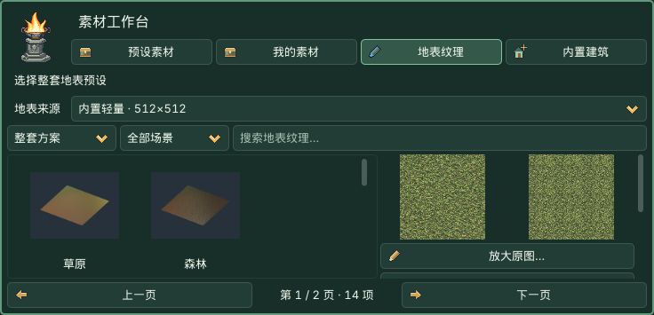

# 第三部分 · 地形

> **GitHub 公开版说明：**下文保留 0.4.6 原学习版说明。三位游戏提取角色预设、可选共享素材库与历史案例包未随公开版提供；内置建筑与地表已包含，角色可使用自己的素材。[查看分发说明](../../DISTRIBUTION.md)

**设置地图规格 → 选择地表方案 → 右侧预览 → 底部应用。** 已有地形可直接雕刻和绘制，不必重新创建。

## 地形制作引导

地形页最上方显示实时地形预览，显示新地图草稿或当前地形与未应用地表。**地图规格…** 打开设置。此处直接看地形／草稿预览；需要运行场景时，从 **镜头 → 预览当前场景** 进入。

右侧最下方的淡金色应用框固定在滚动区外，浅黄色按钮突出主要动作：新地图草稿显示 **应用：创建地图**，已有地形显示 **应用地表设置**。预览使用简化网格；实际创建采用所选采样点数。雕刻和绘制直接修改场景；应用按钮只提交新地图或地表草稿，保存仍用 Cmd+S / Ctrl+S。

## 可折叠功能分组

点击标题展开／收起；★为首次默认展开，之后记住本工程选择。**全部展开／全部收起**只影响当前页。Tab 聚焦标题，Enter/Space 切换，左/右键收起或展开。折叠保留草稿与活动工具，不应用、不保存。

| 分组 | 生效方式 |
| --- | --- |
| [新建地图](#group-terrain-template) | 设置规格和地表，在侧栏底部点击“应用：创建地图”。 |
| ★ [地形雕刻](#group-terrain-brush) | 在原生 3D 视口按住左键直接修改高度。 |
| [地表层与绘制](#group-terrain-layers) | 选纹理进入草稿；应用后绘制各层占比。 |
| [贴地维护](#group-terrain-conform) | 雕刻后自动或手动更新关联植物和道路。 |
| [地形制作引导](#group-terrain-world) | 新地图草稿／当前地形预览；地图规格入口。 |

**新建地图**

**地形雕刻**

**地表层与绘制**

**贴地维护**

****

## 1. 创建地图

顶部与地形页的 **新建地图…** 打开同一个窗口。默认 **自由地图、64 米、129 个采样点/边**，采样间距 **0.5 米**。

64 米表示 **X、Z 两边各 64 米**，面积为 64×64 平方米。高度采样是记录高低的网格点，不是高度上限；129 表示每边 129 点，总计 16,641 点。**点间距=边长÷(点数−1)**。

尺寸和点数都可选 **自定义…**：边长 1–4096 米、步长 0.5 米；每边点数 3–513、整数。例如 75.5 米 / 100 点，间距约 0.763 米。点越密，细小坡度越细腻，内存和编辑成本也越高。窗口底部点 **使用纯色地表**，或点 **选择预设方案…** 后在底部素材工作台单击方案。设置窗口随即隐藏，参数保留；查看右侧预览后，点侧栏底部 **应用：创建地图**。选方案不会创建场景，也不会重新弹出设置窗口。关闭设置窗口的 × 放弃本次新建草稿。

创建后得到独立场景和外部地形资源，保存于 levels；同名文件自动加编号。每次创建使用独立资源，不缩放、重采样或清空现有地形。“另存场景”仍不会自动复制所有引用资源。

### 湖、河、海和火山

**地形形状**提供平地、湖泊与湖岸、蜿蜒河谷、海岸沙滩、大海与小岛、火山口。右侧预览形状，创建时使用左侧设定的点数。立体预设使用自由地图；循环舞台使用平地，避免滚动物件与高度错位。

1. 选择地形形状。
2. 需要水面时保持 **生成独立水面／熔岩** 开启，再设置动画速度；速度 0 表示停止。
3. 点窗口底部 **选择预设方案…**，在工作台选择湖岸、河岸、海岸、小岛或火山方案；也可选择 **使用纯色地表**。确认右侧预览，点击侧栏底部 **应用：创建地图**。没有共享库也能选择内置预设或使用纯色创建。
4. 创建后继续雕刻、绘制。在场景树选择 **Water / Lava**，通过 Inspector 的 Position Y 改水位、Extent 改覆盖尺寸、Animation Speed 改速度、Water Color / Lava Color 改颜色。雕刻不会自动改变水位。

水面和熔岩仅提供动画外观，无流体、游泳、浮力或伤害逻辑。水面没有碰撞，角色仍站在地形上；游戏需要游泳或熔岩伤害时须另加逻辑。

**湖泊与湖岸**

**蜿蜒河谷**

**海岸沙滩**

**大海与小岛**

**火山口**

## 2. 雕刻高度

**制作过程中可以直接修改已有地形，不必再次新建地图。** 在场景树选中包含地形的 HD2DStage，或其中的 HD2DTerrain，再使用雕刻工具或地表绘制。原生网格地板（如案例05）不是可雕刻的高度地形。

地形页上方的 **只显示地形（临时）** 可隐藏当前场景的建筑、角色、植被、道路、水面／熔岩和场景界面，保留地形、灯光与笔刷。新出现的物件也会隐藏。取消勾选、离开地形页、切换场景或关闭插件会恢复；原本隐藏的物件仍隐藏。这只改变编辑视图，保存、运行及隔离测试仍显示正常场景，不需要点击应用按钮。

| 工具 | 逻辑 |
| --- | --- |
| 升高／降低 | 按每秒强度增减高度，中心强、边缘弱。 |
| 平滑 | 缓和相邻高度差，不把整块地形清零。 |
| 平台 | 逐渐趋近目标高度；填入数值后仍须使用工具。 |
| 坡道 | 从按下处已有高度连接至拖动终点的目标高度，形成连续坡面；无拖动方向时不生成坡道。 |

升降、平滑、平台和绘制支持 **按住不动持续生效**。强度按时间累计；松开、Esc 或窗口失焦结束本笔，一笔一次撤销。雕刻和绘制分别记住半径、强度。只有平台／坡道显示目标高度。

笔刷命中当前地形，不被布景物件截获。请在原生 3D 编辑区操作，隔离预览里不能绘制。地形保持原点、缩放 1 便于按米调整。

## 3. 内置地表在哪里选

主入口：**地形 → 地表层与绘制 → 选择预设纹理…／选择整套预设…**，或 **素材工作台 → 地表纹理**。

0.4.6 第一包已内置 **35 张原创 512×512 地表纹理、14 套方案**，无需安装或连接共享素材库。轻量原图约 18.1 MiB；加缩略图与索引约 19.6 MiB。使用最近邻缩小以保留硬边像素；平铺周期和稳定标识保持不变。原 1024×1024 文件仍在共享库。

浏览只读取索引及当前页缩略图，不会首次启动就导入全部原图。选中纹理或方案后，只将所需图片准备到当前工程的 `hd2d_imports/terrain`；再次选择相同内容会复用。保存场景时保留该目录，运行不依赖外部共享库。

工作台的 **地表来源** 默认是 **内置轻量 · 512×512**；需要原尺寸时，在顶部 **位置…** 连接共享库，再选择 **共享原图 / 扩展 · 1024×1024**。两种来源分开浏览，切换来源不会自动替换已应用纹理。外部库不可用时，可切回内置预设继续使用。

1. 选择单张纹理或整套方案，按场景、搜索与分页浏览；单层入口会提示正在修改第几层。
2. 单击条目会准备资源并立即选入草稿，同时更新预览。查看原图、3×3 重复铺贴和独立地表；**放大原图…** 打开大图。切换 **柔和光照预览／原色预览（无光照）** 可区分纹理本色与光照影响，不改变场景灯光。
3. 无需再次点击“使用”或“取消选择”。卡片显示“第 N 层 · 实际纹理名称”、缩略图和“未应用”。
4. 调整所有层共用重复周期，**数值越大，图案越大**。点击右侧最下方 **应用地表设置** 一次提交；**还原未应用修改** 放弃草稿。
5. 点击层卡片，再点 **绘制第 N 层**。有草稿时先应用或还原。换纹理保留高度和已绘制分布。

浏览只读索引与当前页缩略图；实际预览才复制并导入单张或方案所需张数，相同内容按哈希复用。共享库未安装、旧包缺少地表目录或磁盘断开时会提示原因；本地图片、纯色与已准备完整的场景继续可用。不要把整个共享库放入工程扫描范围。

35 张 512×512 原创 PNG 组成 14 套方案；湖岸等复用相应原图，按下列顺序填入纹理槽：

| 场景 | 纹理顺序 |
| --- | --- |
| 草原 | 短草、黄绿草、裸土、细砾土 |
| 森林 | 苔草、腐殖土、落叶、苔石 |
| 农田 | 田埂草、耕土、干土、泥径 |
| 古镇 | 青石板、夯土地、旧砖地、碎石路 |
| 山地 | 灰岩、风化岩、碎石、稀草土 |
| 沙漠 | 细沙、风纹沙、干裂土、砂岩 |
| 雪地 | 积雪、压实雪、冻土、霜岩 |
| 湿地 | 湿草、淤泥、湿砂、湿卵石 |
| 火山 | 玄武岩、火山灰、冷却熔岩（3 层） |
| 湖岸 | 苔草、湿卵石、淤泥（3 层） |
| 河岸 | 短草、湿砂、湿卵石（3 层） |
| 海岸 | 稀草土、细沙、湿砂（3 层） |
| 小岛 | 短草、细沙（2 层） |
| 纯积雪 | 积雪（1 层） |

使用 imagegen 重新制作纹理结构，参考整体像素武侠美术特征，没有复制、拼贴或仅调色提取原图。尚无原图商业使用及原文件再分发授权。新地表来源独立记录；**既有提取模型、音乐、截图仍为本机学习素材，整个共享包不因此成为商用素材包。**

## 4. 绘制与维护

平地初始全部为第 1 层，应用该层图片后可立即看到底色；其他层需绘制才出现。这是场景制作常见的“地表纹理绘制”：多张纹理在同一地面按占比混合，层号不代表上下遮挡顺序。增加一层占比会减弱其他层；想擦回底色就绘制第 1 层。湖、河等形状预设已预先绘制高地、岸边和底部的分布。

默认 4 层适合草、土、岩石、道路等组合，游戏没有统一的“四层上限”。复杂区域可点 **增加地表层（最多 8 层）**，应用后绘制新层。第五层起增加额外权重和纹理采样成本，无需加满。旧四层地形保留原材质路径。新建时使用 1–3 张方案就是 1–3 层；将较短方案应用到已有地图，只替换对应槽，保留其余层和已画分布，避免误删。

雪地的积雪、压实雪与沙漠的细沙、风纹沙已重绘。先用原色预览检查，再看柔和光照；实际场景过白时检查环境亮度和灯光强度。

**松开笔刷后自动贴地** 默认开启，仅在高度变化后更新关联植物和道路，与雕刻共用一次撤销。纹理绘制不触发贴地。关闭自动后，**重新贴地：植物与道路** 是单独可撤销的操作。

旧案例复合材质不自动转换。先点 **预览四层地表**，确认外观后点底部 **应用地表设置**。保留四槽、高度与权重，不烘焙旧材质；外观会变化，一次撤销可恢复。

应用不是保存。最后按 **Cmd+S / Ctrl+S**，重开检查笔触。切换地形会清理未应用草稿；撤销重做后卡片同步实际状态。

## 逐项参数

| 参数 | 初始默认 | 范围 / 步长 / 选项 | 含义 |
| --- | --- | --- | --- |
| 地图类型 | 自由地图 / Free map | 自由地图／循环舞台 · Free / Loop | 只用于新地图。 |
| 地图每边长度（米） | 64 | 64, 128, 256, 512；自定义 1–4096 / 0.5 | X、Z 每边长度，只用于新地图。 |
| 每边高度点数 | 129 | 129, 257, 513；自定义 3–513 / 1 | 间距=尺寸÷(采样数−1)。 |
| 只显示地形（临时） | 关闭 | 开／关 | 临时编辑视图，不保存到场景。 |
| 雕刻半径（米） | 4 | 0.2 … 64; 0.1 | 半径，不是直径。 |
| 雕刻强度 / 秒 | 3 | 0.05 … 30; 0.05 | 每秒高度增减或趋近速度。 |
| 平台 / 坡道终点高度 | 2 | -50 … 100; 0.1 | 地形本地高度（米）。 |
| 当前层卡片 | 1 | 1–8 | 实际名称；空层显示未设置（纯色）。 |
| 纹理重复周期（米） | 2 | 0.1 … 32; 0.1 | 所有层共用，应用后生效。 |
| 绘制半径（米） | 4 | 0.2 … 64; 0.1 | 与雕刻设置分别记忆。 |
| 绘制强度 / 秒 | 3 | 0.05 … 30; 0.05 | 改变占比，不改高度。 |
| 松开笔刷后自动贴地 | 开启 / On | 开／关 · On / Off | 本工程记忆。 |

本版提供固定地形形状和简单水面／熔岩外观，不提供现有地形尺寸重采样、随机生成、洞穴、悬空地形、LOD 或流体模拟。先用 64 米 / 129 采样练习；大采样网格成本较高。循环舞台若沿滚动方向起伏，仍需检查布景与地面的吻合。
